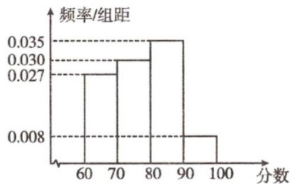

## 题型01 频率分布直方图的绘制与应用

【典例1】某校举办了“校园安全”主题教育活动及知识竞赛（得分均为整数，满分为 $100$ 分）·从参赛的学生

中随机抽取了 $100$ 人，统计其本次竞赛成绩，将数据按照 $[60,70)$ ， $[70,80)$ ， $[80,90)$ ， $[90,100]$ 分成 $4$ 组，制

成如图所示的频率分布直方图·

(1)试估计本次竞赛成绩的平均分；（同一组中的数据用该组区间的中点值作代表）

(2)该校准备对本次竞赛成绩排名前 $15\%$ 的学生进行嘉奖，则受嘉奖的学生分数不低于多少？

【答案】(1)77.4 (2)88 分.

【分析】（ $^{1}$ ）由频率分布直方图数据计算平均数即可；

(2) 设受嘉奖的学生分数不低于 x 分，由 $0.035 \times (90 - x) + 0.008 \times 10 = 0.15$ 得出 x 即可求解.

【详解】（1）本次竞赛成绩的平均分 $\overline{x}=65\times0.27+75\times0.3+85\times0.35+95\times0.08=77.4$

(2) 由频率分布直方图，可得最后一组的频率为 $0.008 \times 10 = 0.08$

后 $^{2}$ 组的频率之和为 $(0.008+0.035)\times10=0.43$ .

设受嘉奖的学生分数不低于 x 分，则 $x \in [80, 90)$ .

$0.035 \times (90 - x) + 0.008 \times 10 = 0.15$ ，解得 x = 88。

故受嘉奖的学生分数不低于 $^{88}$ 分.

## 方法技巧

绘制频率分布直方图的注意事项

1、在列频率分布表时，极差、组距、组数有如下关系：

(1) 若为整数，则 = 组数；

(2) 若不为整数，则的整数部分 +1 = 组数。

2、组距和组数的确定没有固定的标准，将数据分组时，组数力求合适，纵使数据的分布规律能较清楚地呈现

出来，组数太多或太少，都会影响我们了解数据的分布情况，若样本容量不超过100，按照数据的多少常分

为 5～12 组，一般样本容量越大，所分组数越多。

![[高中/课堂同步/题库/人教A版高中数学同步讲义(2026)/02_必修第二册/第九章 统计/讲义/专题9_2_用样本估计总体_高效培优讲义_数学人教A版高一必修第二册/_compact/Q00064870.md]]
![[高中/课堂同步/题库/人教A版高中数学同步讲义(2026)/02_必修第二册/第九章 统计/讲义/专题9_2_用样本估计总体_高效培优讲义_数学人教A版高一必修第二册/_compact/Q00064871.md]]
![[高中/课堂同步/题库/人教A版高中数学同步讲义(2026)/02_必修第二册/第九章 统计/讲义/专题9_2_用样本估计总体_高效培优讲义_数学人教A版高一必修第二册/_compact/Q00064872.md]]
