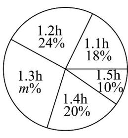

## 题型03 对折线图、扇形图、条形图的识读

【典例1】为了解某校八年级学生每天做家庭作业的时间（单位：h），随机调查了该校八年级部分学生每天

做家庭作业的时间·根据统计的结果，绘制出如下的统计图①和图②·

图①

图②

请根据相关信息，解答下列问题：

(1)填空：图①中 m 的值为\_\_\_\_，统计的这部分学生每天做家庭作业时间的众数为\_\_\_\_，中位数为\_\_\_\_；

(2)求统计的这部分学生每天做家庭作业时间的平均数；

(3)根据样本数据，若该校八年级共有学生 $^{450}$ 人，估计该校八年级学生每天做家庭作业的时间超过 $^{1.2h}$ 的人

数约为多少？

【答案】(1)28；1.3 h；1.3 h (2)1.28 h (3)261 人

【分析】（ $^{1}$ ）根据扇形图中百分比之和为 $^{1}$ 求得m，利用众数和中位数的定义求得答案；

(2) 根据平均数的定义列式求解；

(3) 求出样本中每天做家庭作业的时间超过 $1.2 \mathrm{~h}$ 的百分比，由此估计该年级450人中，每天做家庭作业的

时间超过 $1.2 \mathrm{~h}$ 的学生人数·

【详解】（1）∵ $m\% = 100\% - 18\% - 24\% - 20\% - 10\% = 28\%$ ，∴ m = 28.

$\because$ 每天做家庭作业 1.3 h 的人数有 $^{14}$ 人，人数最多，

$\therefore$ 众数为 1.3 h ;

由题意，得统计的总人数为 $9 \div 18\% = 50$ 人，

从小到大依次排序，处在中间位置的序号为 $^{25}$ 和 $^{26}$ ，对应的数据都是 $^{1.3}$ ，

∴中位数为 $\frac{1.3+1.3}{2}=1.3(h)$

$$
\overline {{x}} = \frac {1 . 1 \times 9 + 1 . 2 \times 1 2 + 1 . 3 \times 1 4 + 1 . 4 \times 1 0 + 1 . 5 \times 5}{5 0} = 1. 2 8 (\mathrm{h}) \tag {2}
$$

∴ 1.28 h
统计的这部分学生每天做家庭作业时间的平均数为；

(3)∵ 在抽取的样本中，每天做家庭作业的时间超过 $1.2\mathrm{h}$ 的占 $28\% + 20\% + 10\% = 58\%$

估计该年级 $^{450}$ 人中，每天做家庭作业的时间超过1.2 h的学生人数为 $450 \times 58\% = 261$ （人），

估计该校八年级学生每天做家庭作业的时间超过 1.2 h 的人数约为 261 人·

## 方法技巧

条形统计图反映各组数据的频数或频率；

扇形统计图反映各组数据占总数的比例；

折线统计图反映数据随时间的变化趋势.

![[高中/课堂同步/题库/人教A版高中数学同步讲义(2026)/02_必修第二册/第九章 统计/讲义/专题9_2_用样本估计总体_高效培优讲义_数学人教A版高一必修第二册/_compact/Q00064876.md]]
![[高中/课堂同步/题库/人教A版高中数学同步讲义(2026)/02_必修第二册/第九章 统计/讲义/专题9_2_用样本估计总体_高效培优讲义_数学人教A版高一必修第二册/_compact/Q00064877.md]]
![[高中/课堂同步/题库/人教A版高中数学同步讲义(2026)/02_必修第二册/第九章 统计/讲义/专题9_2_用样本估计总体_高效培优讲义_数学人教A版高一必修第二册/_compact/Q00064878.md]]
![[高中/课堂同步/题库/人教A版高中数学同步讲义(2026)/02_必修第二册/第九章 统计/讲义/专题9_2_用样本估计总体_高效培优讲义_数学人教A版高一必修第二册/_compact/Q00064879.md]]
![[高中/课堂同步/题库/人教A版高中数学同步讲义(2026)/02_必修第二册/第九章 统计/讲义/专题9_2_用样本估计总体_高效培优讲义_数学人教A版高一必修第二册/_compact/Q00064880.md]]
![[高中/课堂同步/题库/人教A版高中数学同步讲义(2026)/02_必修第二册/第九章 统计/讲义/专题9_2_用样本估计总体_高效培优讲义_数学人教A版高一必修第二册/_compact/Q00064881.md]]
