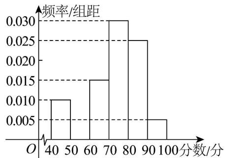

<!-- question-source:start -->
【变式2】新高考模式下，学生是否选择物理作为高考考试科目对大学专业选择有着非常重要的意义．合肥

六中为了解高一年级 $^{1800}$ 名学生物理科目的学习情况，将他们某次物理测试成绩（满分 $^{100}$ 分）按照

$[40,50), [50,60), [60,70), [70,80), [80,90), [90,100]$ 分成 $^6$ 组，制成如图所示的频率分布直方图。

(1)求 1800 名学生中物理测试成绩在 $[50,60)$ 内的频数并补全频率分布直方图.

(2)学校建议，本次物理测试成绩不低于 $a$ 分的学生选择物理为高考考试科目，若学校希望高一年级恰有 $70\%$

的学生选择物理为高考考试科目，试求 $a$ 的估计值（结果精确到0.1）.

(3)已知落在 $[60,70)$ 的学生成绩的平均数为 $\overline{x}$ ，方差 $s_1^2 = 4$ ，落在 $[70,80)$ 的学生成绩的平均数为 $\overline{y}$ ，方差 $s_2^2 = 6$ ，若两组学生成绩的平均数之差不大于 $6$ ，求落在 $[60,80)$ 的学生成绩的方差 $s^2$ 的最大值。
<!-- question-source:end -->

![[高中/课堂同步/题库/人教A版高中数学同步讲义(2026)/02_必修第二册/第九章 统计/讲义/专题9_2_用样本估计总体_高效培优讲义_数学人教A版高一必修第二册/题型06_标准差与方差的应用_sec_15/questions/answers/Q00064886A1.md]]
