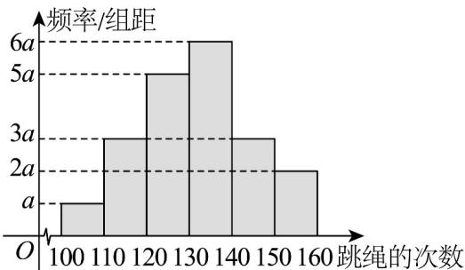

> [!faq]- 《专题9_2_用样本估计总体_高效培优讲义_数学人教A版高一必修第二册》官方解析
>
> > [!success]- **【答案】**  A. $a = 0.05$ B. 估计该年级学生跳绳次数的 $60\%$ 分位数约为135 C. 估计该年级学生跳绳次数在140次及以上的学生跳绳次数的平均数为147.5 D. 估计该年级学生跳绳次数在140次及以上的学生跳绳次数的方差为26.2
>
> > [!note]- **【分析】**
> > 对于 $^{A}$ 选项，频率分布直方图里各长方形面积和为1，把各区间频率系数相加乘组距得到总面积表
> >
> > 达式，令其等于1，即可求出a；
> >
> > 对于 $^{B}$ 选项，先算出前几个矩形面积和，通过与0.6比较，确定60%分位数所在区间·再根据百分位数的定义，
> >
> > 用已有的面积和加上该区间的面积等于0.6，列方程求解百分位数；
> >
> > 对于 $^{C}$ 选项，根据加权平均的方法，以比例为权重乘以对应数值，即可求解平均数；
> >
> > 对于 $D$ 选项，根据方差公式，以不同区域的比例为权重，分别计算每个区间数值与平均数差值的平方加上给
> >
> > 定值，再求和得到方差·
>
> > [!note]- **【解析】**
> > 对于 A，由频率分布直方图中各长方形面积和为 1，得 $(a + 2a + 3a + 3a + 5a + 6a) \times 10 = 1$ ，解得
> >
> > $a = 0.005$ ，故 $\mathsf{A}$ 错误；
> >
> > 对于 $^{B}$ ，根据百分位数的计算，假设该年级学生跳绳次数的60%分位数为x，则
> >
> > $(a+3a+5a)\times10+6a\times(x-130)=0.6$ ，又 a=0.005，所以解得 x=135，故 B 正确；
> >
> > 对于 $^{C}$ ，该年级学生跳绳次数在140次及以上的学生跳绳次数的平均数为
> >
> > $145 \times \frac{3a \times 10}{3a \times 10 + 2a \times 10} + 155 \times \frac{2a \times 10}{3a \times 10 + 2a \times 10} = 149$ ，故 $^{C}$ 错误；
> >
> > 对于 D，该年级学生跳绳次数在 140 次及以上的学生跳绳次数的方差为
> >
> > $$
> > \frac {3 a \times 1 0}{3 a \times 1 0 + 2 a \times 1 0} \times \left[ 2 + (1 4 9 - 1 4 5) ^ {2} \right] + \frac {2 a \times 1 0}{3 a \times 1 0 + 2 a \times 1 0} \left[ 2. 5 + (1 5 5 - 1 4 9) ^ {2} \right] = 2 6. 2, \text {故} ^ {\mathrm{D}} \text {正确}.
> > $$
> >
> > 故选 **BD**.
