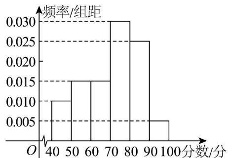

> [!faq]- 《专题9_2_用样本估计总体_高效培优讲义_数学人教A版高一必修第二册》官方解析
>
> > [!success]- **【答案】** (1)图见解析 (2) $a \approx 63.3$ (3) $\frac{40}{3}$
>
> > [!note]- **【分析】**
> > （1）根据频率分布直方图各小矩形面积和为 $^{1}$ 及频率、频数的关系求解
> >
> > (2) 根据频率分布直方图求第 70 百分位数可得；
> >
> > (3) 根据方差的求法，方差转化为 $s^{2}=\frac{1}{3}s_{1}^{2}+\frac{2}{3}s_{2}^{2}+\frac{2}{9}\left(\overline{x}-\overline{y}\right)^{2}$ ，进而可得
>
> > [!note]- **【解析】**
> > （1）由频率分布直方图可得物理测试成绩在 $[50,60)$ 的频率为 $f = 1 - 10\times (0.01 + 0.015 + 0.03 + 0.025 + 0.005) = 0.15$
> >
> > 频数为 $1800 \times 0.15 = 270$
> >
> > 所以 $^{1800}$ 名学生中物理测试成绩在 $[50,60)$ 内的频数为 $^{270}$ ，补全频率分布直方图如图所示。
> >
> > 
> >
> > (2) 易得前两段频率之和为 $0.25 < 0.3$ ，前三段频率之和 $0.4 > 0.3$
> >
> > 则有 $a\in [60,70)$
> >
> > 满足 $(a-60)\times0.015=0.3-0.25=0.05$ ，所以 $a\approx63.3$ （分）
> >
> > (3) 成绩在 $\left[60,70\right)$ 的频数为 270 人， $\overline{x}=\frac{1}{270}\sum_{i=1}^{270}x_{i}$
> >
> > 成绩在 $[70,80)$ 的频数为 $540$ 人， $\overline{y} = \frac{1}{540}\sum_{i=1}^{540}y_i$
> >
> > 所以 $[60,80)$ 的学生成绩的平均值为 $\overline{z} = \frac{1}{810}\left(\sum_{i=1}^{270}x_i + \sum_{i=1}^{540}y_i\right) = \frac{\overline{x} + 2\overline{y}}{3}$
> >
> > 由方差公式知， $270s_{1}^{2}=\sum_{i=1}^{270}\left(x_{i}-\bar{x}\right)^{2},540s_{2}^{2}=\sum_{i=1}^{540}\left(y_{i}-\bar{y}\right)^{2}$
> >
> > 所以该班成绩的方差为：
> >
> > $$
> > s ^ {2} = \frac {1}{8 1 0} \left[ \sum_ {i = 1} ^ {2 7 0} \left(x _ {i} - \bar {z}\right) ^ {2} + \sum_ {i = 1} ^ {5 4 0} \left(y _ {i} - \bar {z}\right) ^ {2} \right] = \frac {1}{8 1 0} \left[ \sum_ {i = 1} ^ {2 7 0} \left(x _ {i} - \bar {x} + \bar {x} - \bar {z}\right) ^ {2} + \sum_ {i = 1} ^ {5 4 0} \left(y _ {i} - \bar {y} + \bar {y} - \bar {z}\right) ^ {2} \right]
> > $$
> >
> > $$
> > = \frac {1}{8 1 0} \left[ \sum_ {i = 1} ^ {2 7 0} \left(x _ {i} - \bar {x}\right) ^ {2} + 2 7 0 (\bar {x} - \bar {z}) ^ {2} + 2 (\bar {x} - \bar {z}) \sum_ {i = 1} ^ {2 7 0} \left(x _ {i} - \bar {x}\right) + \sum_ {i = 1} ^ {5 4 0} \left(y _ {i} - \bar {y}\right) ^ {2} + 5 4 0 (\bar {y} - \bar {z}) ^ {2} + 2 (\bar {y} - \bar {z}) \sum_ {i = 1} ^ {5 4 0} \left(y _ {i} - \bar {x}\right) \right]
> > $$
> >
> > $$
> > = \frac {1}{8 1 0} \left(2 7 0 s _ {1} ^ {2} + 5 4 0 s _ {2} ^ {2} + 2 7 0 (\bar {x} - \bar {z}) ^ {2} + 5 4 0 (\bar {y} - \bar {z}) ^ {2}\right)
> > $$
> >
> > $$
> > = \frac {1}{3} s _ {1} ^ {2} + \frac {2}{3} s _ {2} ^ {2} + \frac {1}{3} (\bar {x} - \bar {z}) ^ {2} + \frac {2}{3} (\bar {y} - \bar {z}) ^ {2}
> > $$
> >
> > $$
> > = \frac {1}{3} s _ {1} ^ {2} + \frac {2}{3} s _ {2} ^ {2} + \frac {2}{9} (\bar {x} - \bar {y}) ^ {2} \leq \frac {4 0}{3}
> > $$
> >
> > 所以 $s^2$ 的最大值为 $\frac{40}{3}$
