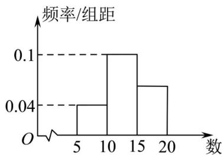

> [!faq]- 《专题9_3_统计案例_公司员工的肥胖情况调查分析_高效培优讲义_数学人》官方解析
>
> > [!success]- **【答案】** （ $^{1}$ ）众数为65，中位数为65；（ $^{2}$ ）67。
>
> > [!note]- **【分析】**
> > （1）用频率分布直方图中最高矩形所在的区间的中点值作为众数的近似值，即可得出众数，利用中
> >
> > 位数的两边频率相等，即可求得中位数；
> >
> > (2) 利用各小组底边的中点值乘以对应的频率求和，即可求得成绩的平均值.
>
> > [!note]- **【解析】**
> > （ $^{1}$ ）用频率分布直方图中最高矩形所在的区间的中点值作为众数的近似值，得出众数为65，
> >
> > 又因为第一个小矩形的面积为 0.3，
> >
> > 设第二个小矩形底边的一部分长为 $x$ ，则 $x \times 0.04 = 0.2$ ，解得 $x = 5$ ，所以中位数为 $60 + 5 = 65$
> >
> > (2) 依题意，利用平均数的计算公式，
> >
> > 可得平均成绩为： $55 \times 0.3 + 65 \times 0.4 + 75 \times 0.15 + 85 \times 0.1 + 95 \times 0.05 = 67$
> >
> > 所以参赛学生的平均成绩为67分.
> >
> > 
