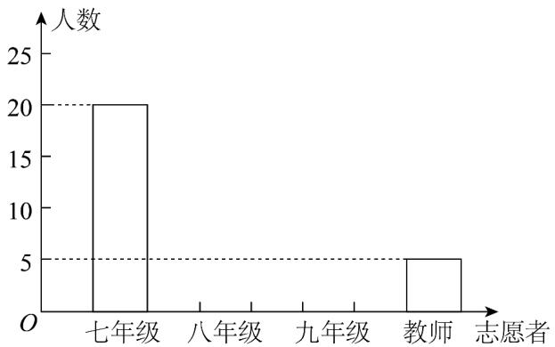
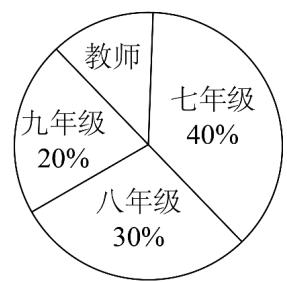

<!-- question-source:start -->
【变式1】某初级中学正在开展“文明城市创建人人参与，志愿服务我当先行”的创文活动·为了了解该校志愿

者参与服务的情况，现对该校全体志愿者进行随机抽样调查·根据调查数据绘制了不完整统计图（如图），条

形统计图中七年级、八年级、九年级、教师分别指七年级、八年级、九年级、教师志愿者中被抽到的志愿者，

扇形统计图中的百分数指的是该年级被抽到的志愿者人数与样本容量的百分比·

(1) 请补全条形统计图·

(2) 请你求出扇形统计图中教师所对应的扇形的圆心角的度数.

(3) 若该校共有志愿者600人，则该校七年级大约有多少名志愿者？
<!-- question-source:end -->

![[高中/课堂同步/题库/人教A版高中数学同步讲义(2026)/02_必修第二册/第九章 统计/讲义/专题9_3_统计案例_公司员工的肥胖情况调查分析_高效培优讲义_数学人/题型精讲_sec_02/questions/answers/Q00064895A1.md]]
