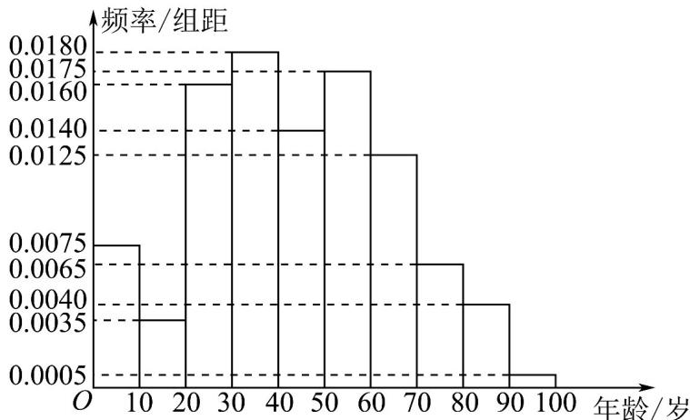

<!-- question-source:start -->
【变式3】2018年北京市进行人口抽样调查，随机抽取了某区居民 $^{13289}$ 人，记录他们的年龄(单位：岁)，将数据

分成 10 组: $[0,10)$ , $[10,20)$ , $[20,30)$ , ..., $[90,100]$ , 并整理得到如下频率分布直方图:

(1)估计该区居民年龄的中位数(精确到0.1);

(2)假设同组中的每个数据用该组区间的中点值代替,估计该区居民的平均年龄.
<!-- question-source:end -->

![[高中/课堂同步/题库/人教A版高中数学同步讲义(2026)/02_必修第二册/第九章 统计/讲义/专题9_3_统计案例_公司员工的肥胖情况调查分析_高效培优讲义_数学人/题型精讲_sec_02/questions/answers/Q00064896A1.md]]
