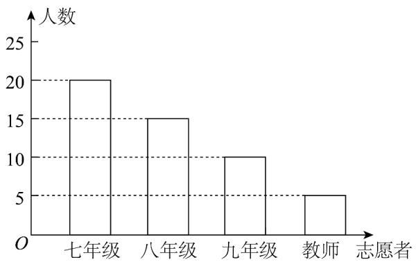
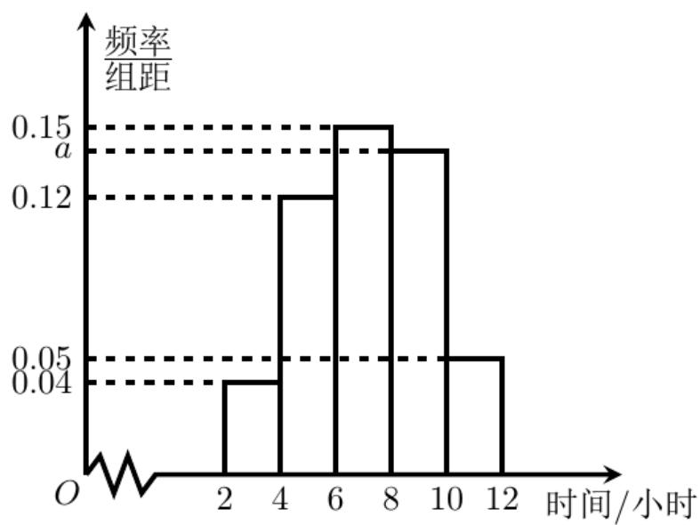

> [!faq]- 《专题9_3_统计案例_公司员工的肥胖情况调查分析_高效培优讲义_数学人》官方解析
>
> > [!success]- **【答案】** $(1)$ 条形统计图见解析； $(2)$ 36°； $(3)$ 240名·
>
> > [!note]- **【分析】**
> > （1）本题首先可根据题意求出样本容量、八年级志愿者被抽到的人数以及九年级志愿者被抽到的人
> >
> > 数，然后补全条形统计图即可；
> >
> > (2) 可根据教师志愿者被抽到的人数所占百分比求出对应的圆心角的度数；
> >
> > (3) 可通过总人数以及七年级志愿者所占比例得出结果.
>
> > [!note]- **【解析】**
> > （1）由题意知样本容量为 $20 \div 40\% = 50$ ，则八年级志愿者被抽到的人数为 $50 \times 30\% = 15$ ，
> >
> > 九年级志愿者被抽到的人数为 $50 \times 20\% = 10$
> >
> > 补全条形统计图如下：
> >
> > 
> >
> > $$
> > 5 \div 50 = 10
> > $$
> >
> > $$
> > 360^{\circ}\times 10\% = 36^{\circ}
> > $$
> >
> > $$
> > 600 \times 40\% = 240
> > $$
> >
> > $$
> > 2 4 0
> > $$
> >
> > $$
> > 1 0 0
> > $$
> >
> > 实践活动的时间，绘成的频率分布直方图如图所示
> >
> > 
> > (1) 求这 $^{100}$ 名学生中参加实践活动时间在 $6 \sim 10$ 小时的人数；
> >
> > (2) 估计这 $^{100}$ 名学生参加实践活动时间的众数、中位数和平均数·
> >
> > 【答案】 $(1)^{58}$ ; $(2)^{7}$ 众数 $^{7}$ ，中位数 $^{7.2}$ ，平均数 $^{7.16}$
> >
> > 【解析】(1)求出参加实践活动时间在 $6 \sim 10$ 小时的人所占的频率,再求解人数即可.
> >
> > (2)根据最高矩形底边中点的横坐标计算众数,利用中位数左右两边的频率均为 0.5 以及平均数的算法求解即可.
> >
> > 【详解】（1） $100\times[1-(0.04+0.12+0.05)\times2]=58$ ，即这 $^{100}$ 名学生中参加实践活动时间在 $6\sim10$ 小时的人
> >
> > 数为 58.
> >
> > (2) 由频率分布直方图可以看出，最高矩形底边中点的横坐标为 $7$ ，故这 $100$ 名学生参加实践活动时间的众
> >
> > 数的估计值为 $^{7}$ 小时· $(0.04+0.12)\times2=0.32$ ； $(0.04+0.12+0.15)\times2=0.62$ ，中位数 $^{t}$ 满足6<t<8·由
> >
> > $0.32 + (t - 6) \times 0.15 = 0.5$ ，得 $t = 7.2$ ，即这 $^{100}$ 名学生参加实践活动时间的中位数的估计值为 $^2$ 小时·
> >
> > 由 $(0.04 + 0.12 + 0.15 + a + 0.05) \times 2 = 1$ ，解得 $a = 0.14$ .
> >
> > 这 $100$ 名学生参加实践活动时间的平均数的估计值为
> >
> > $$
> > 0. 0 4 \times 2 \times 3 + 0. 1 2 5 \times 2 \times 5 + 0. 1 5 \times 2 \times 7 + 0. 1 4 \times 2 \times 9 + 0. 0 5 \times 2 \times 1 1 = 7. 1 6 \quad (\text {   小时   })
> > $$
