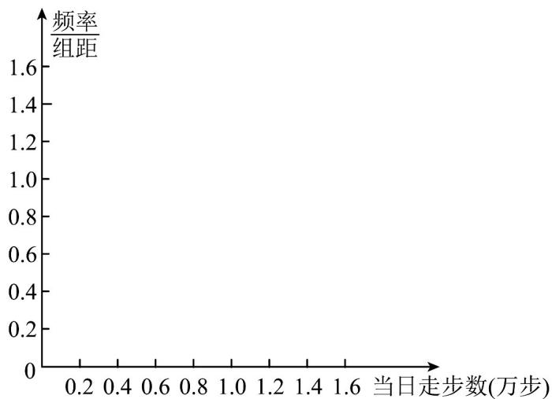
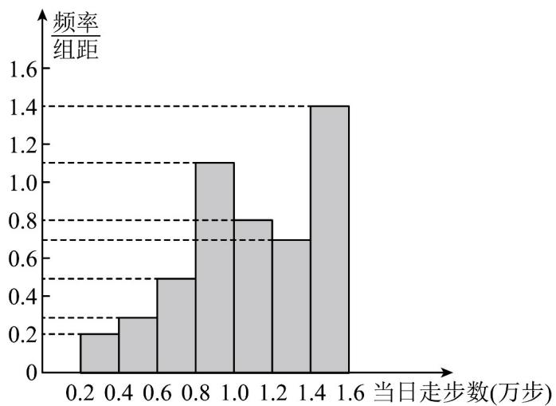

## 题型精讲

## 题型 由统计信息解决实际问题

【典例1】某单位工会有 $500$ 位会员，利用“健步行APP”开展全员参与的“健步走奖励”活动·假设通过简单随机

抽样，获得了 $^{50}$ 位会员 $^{5}$ 月 $^{10}$ 日的走步数据如下：（单位：万步）

1.1 1.4 1.3 1.6 0.3 1.6 0.9 1.4 1.4 0.9

1.4 1.2 1.5 1.6 0.9 1.2 1.2 0.5 0.8 1.0

1.4 0.6 1.0 1.1 0.6 0.8 0.9 0.8 1.1 0.4

0.8 1.4 1.6 1.2 1.0 0.6 1.5 1.6 0.90.7

1.3 1.1 0.8 1.0 1.2 0.6 0.5 0.2 0.8 1.4

频率分布表：

<table><tr><td>分组</td><td>频数</td><td>频率</td></tr><tr><td>[0.2,0.4)</td><td>2</td><td>0.04</td></tr><tr><td>[0.4,0.6)</td><td>a</td><td>0.06</td></tr><tr><td>[0.6,0.8)</td><td>5</td><td>0.10</td></tr><tr><td>[0.8,1.0)</td><td>11</td><td>0.22</td></tr><tr><td>[1.0,1.2)</td><td>8</td><td>0.16</td></tr><tr><td>[1.2,1.4)</td><td>7</td><td>0.14</td></tr><tr><td>[1.4,1.6]</td><td>b</td><td>c</td></tr><tr><td>合计</td><td>50</td><td>1.00</td></tr></table>

频率分布直方图：

(1) 写出 $a, b, c$ 的值；

(2) ①绘制频率分布直方图；

② 假设同一组中的每个数据可用该组区间的中点值代替，试估计该单位所有会员当日步数的平均值；

(3) 根据以上 $^{50}$ 个样本数据，估计这组数据的第 $^{70}$ 百分位数·你认为如果定 $^{1.3}$ 万步为健步走获奖标准，一

定能保证该单位至少 $30\%$ 的工会会员当日走步获得奖励吗？说明理由

【答案】（1）a=3，b=14，c=0.28；（2）①答案见解析；②1.088万步；（3）能，答案见解析

【分析】（1）根据频率之和为1，由题中条件列出方程求解，即可得出 $c = 0.28$ ，由样本容量及对应区间的

频率，即可得出 a ， b ；

(2) ①由题中数据，直接完善频率分布直方图；

②由每组的中间值乘以该组的频率，再求和，即可得出平均数；

(3) 根据题中条件，可直接得出 $70\%$ 分位数；进而可得出 $x = 1.3$ 万时，能满足题意

【详解】（1）因为 $0.04 + 0.06 + 0.10 + 0.22 + 0.16 + 0.14 + c = 1$

$$
\therefore c + 0. 7 2 = 1
$$

$$
\therefore c = 0. 2 8,
$$

因为样本中共 $^{50}$ 人，

$$
\therefore b = 0. 2 8 \times 5 0 = 1 4, a = 0. 0 6 \times 5 0 = 3
$$

$$
\therefore a = 3, b = 1 4, c = 0. 2 8.
$$

(2) ①频率分布直方图如下图所示

②设平均值为 $\overline{x}$ ，则有

$$
\overline {{x}} = 0. 0 4 \times 0. 3 + 0. 0 6 \times 0. 5 + 0. 1 0 \times 0. 7 + 0. 2 2 \times 0. 9 + 0. 1 6 \times 1. 1 + 0. 1 4 \times 1. 3 + 0. 2 8 \times 1
$$

$$
= 0. 0 1 2 + 0. 0 3 + 0. 0 8 + 0. 1 9 8 + 0. 1 7 6 + 0. 1 8 2 + 0. 4 2 = 1. 0 8 8
$$

则该单位所有会员当日步数的平均值为 1.088 万步.

(3) $\because 70\% \times 50 = 35$ ， $\therefore 70\%$ 分位数为第 $^{35}$ 和 $^{36}$ 个数的平均数，

$\because [1.4,1.6]$ 共有 $^{14}$ 人，且 $^{1.3}$ 有 $^{2}$ 个，∴ 第 $^{35}$ 和第 $^{36}$ 个数均为 $^{1.3}$ ，∴ $70\%$ 分位数为 $^{1.3}$ ，

设 $x$ 为会员步数，则 $x = 1.3$ 万时，人数不少于 $30\%$ ，∴能保证 $30\%$ 的工会会员获得奖励·

## 方法技巧

用样本的标准差、方差估计总体的方法

（1）用样本估计总体时，样本的平均数、标准差只是总体的平均数、标准差的近似．实际应用中，当所得数

据的平均数不相等时，需先分析平均水平，再计算标准差（方差）分析稳定情况。

(2) 标准差、方差的取值范围是 $[0, +\infty)$ .

（3）因为标准差与原始数据的单位相同，且平方后可能夸大了偏差的程度，所以虽然方差与标准差在刻画样

本数据的离散程度上是一样的，但在解决实际问题时，一般多采用标准差。

![[高中/课堂同步/题库/人教A版高中数学同步讲义(2026)/02_必修第二册/第九章 统计/讲义/专题9_3_统计案例_公司员工的肥胖情况调查分析_高效培优讲义_数学人/题型精讲_sec_02/questions/Q00064895.md]]
![[高中/课堂同步/题库/人教A版高中数学同步讲义(2026)/02_必修第二册/第九章 统计/讲义/专题9_3_统计案例_公司员工的肥胖情况调查分析_高效培优讲义_数学人/题型精讲_sec_02/questions/Q00064896.md]]
