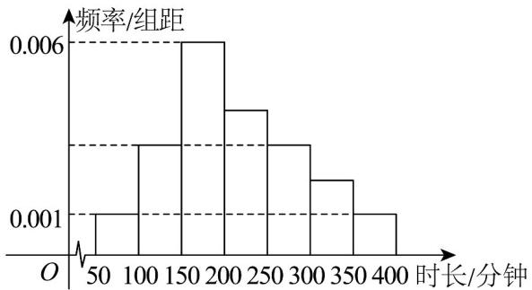

<!-- question-source:start -->
【变式2】为调查某校学生的校志愿者活动情况，现抽取一个容量为 $100$ 的样本，统计了这些学生一周内的

校志愿者活动时长，并绘制了如下图所示的频率分布直方图，记数据分布在 $[50,100)$ ， $[100,150)$ ， $[150,200)$

$$
\left[ 2 0 0, 2 5 0\right), \left[ 2 5 0, 3 0 0\right), \left[ 3 0 0, 3 5 0\right), \left[ 3 5 0, 4 0 0 \right] _ {\text {的频率分别为}} f _ {1}, f _ {2}, \dots , f _ {7} \cdot \text {已知} f _ {1} + f _ {2} + f _ {3} = 0. 5
$$

$$
f _ {4} = 2 f _ {6}
$$

(1)求 $f_{2}$ ， $f_{6}$ 的值；

(2)请根据样本数据估计，全校学生一周内的校志愿者活动平均时长为多少？

(3)学校现在准备对志愿者活动时长排在前 $10\%$ 的学生授予“志愿活动模范之星”的荣誉称号，根据样本数据估

计，志愿者活动时长最少为多少分钟才可能被评为“志愿活动模范之星”？
<!-- question-source:end -->

![[高中/课堂同步/题库/人教A版高中数学同步讲义(2026)/02_必修第二册/第九章 统计/讲义/第九章_统计_高效培优讲义_数学人教A版高一必修第二册/_compact/answers/Q00064939A1.md]]
