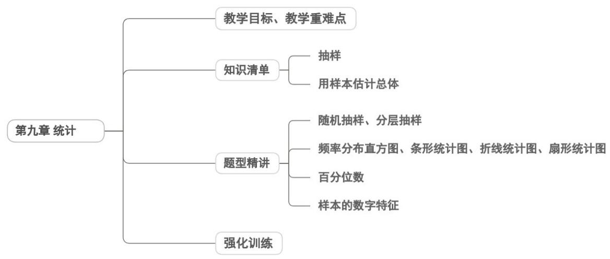

<!-- source-part:1 pages:1-50 -->

## 第九章 统计

## 内容概览

## 教学目标、教学重难点

<table><tr><td>教学目标</td><td>1.核心概念理解掌握总体、个体、样本、样本容量的定义,能区分普查与抽样调查的适用场景;理解简单随机抽样、分层抽样、系统抽样的原理与操作步骤。2.数据处理能力能对数据进行收集、整理、描述,熟练绘制频率分布表、频率分布直方图、茎叶图、散点图等图表;会计算平均数、中位数、众数、方差、标准差等统计量,并理解其统计意义。</td></tr><tr><td>教学重难点</td><td>重点1.核心概念与抽样方法重点掌握总体与样本的关系,简单随机抽样、分层抽样的操作步骤,这是统计推断的基础。2.数据描述与统计量计算核心是频率分布直方图的绘制与解读,平均数、方差的计算与意义,这是分析数据特征的关键工具。3.用样本估计总体理解样本统计量(如样本均值、样本方差)对总体的估计作用,掌握线性回归方程的建立与应用。4.统计思想的渗透体会“抽样—估计—推断”的统计思维,理解统计结论的概率性特征,避免绝对化解读难点1.抽样方法的合理选择难点在于根据总体特征(如总体是否分层、个体分布是否均匀)选择合适的抽样方法,理解分层抽样中样本量的分配原理。2.统计量的深层解读区分平均数、中位数、众数的适用场景,理解方差的“离散程度”本质;易混淆样本方差与总体方差的计算差异。3.线性回归的本质理解难点在于理解线性相关关系的“相关性”与“因果性”的区别,掌握残差分析检验模型拟合效果的方法。4.统计推断的严谨性学生易忽视样本的代表性,过度推广统计结论;需理解抽样误差的存在,学会用概率语言表述推断结果。</td></tr></table>

5. 实际问题的模型转化

难点在于将生活中的问题（如产品质量检测、高考成绩分析）转化为统计模型，设计

合理的抽样与分析方案。

![[高中/课堂同步/题库/人教A版高中数学同步讲义(2026)/02_必修第二册/第九章 统计/讲义/第九章_统计_高效培优讲义_数学人教A版高一必修第二册/知识清单_sec_01/知识清单_sec_01.md]]
![[高中/课堂同步/题库/人教A版高中数学同步讲义(2026)/02_必修第二册/第九章 统计/讲义/第九章_统计_高效培优讲义_数学人教A版高一必修第二册/知识点_01_抽样_sec_02/知识点_01_抽样_sec_02.md]]
![[高中/课堂同步/题库/人教A版高中数学同步讲义(2026)/02_必修第二册/第九章 统计/讲义/第九章_统计_高效培优讲义_数学人教A版高一必修第二册/即学即练_sec_03/即学即练_sec_03.md]]
![[高中/课堂同步/题库/人教A版高中数学同步讲义(2026)/02_必修第二册/第九章 统计/讲义/第九章_统计_高效培优讲义_数学人教A版高一必修第二册/知识点_02_用样本估计总体_sec_04/知识点_02_用样本估计总体_sec_04.md]]
![[高中/课堂同步/题库/人教A版高中数学同步讲义(2026)/02_必修第二册/第九章 统计/讲义/第九章_统计_高效培优讲义_数学人教A版高一必修第二册/即学即练_sec_05/即学即练_sec_05.md]]
![[高中/课堂同步/题库/人教A版高中数学同步讲义(2026)/02_必修第二册/第九章 统计/讲义/第九章_统计_高效培优讲义_数学人教A版高一必修第二册/题型精讲_sec_06/题型精讲_sec_06.md]]
![[高中/课堂同步/题库/人教A版高中数学同步讲义(2026)/02_必修第二册/第九章 统计/讲义/第九章_统计_高效培优讲义_数学人教A版高一必修第二册/题型01_随机抽样_分层抽样_sec_07/题型01_随机抽样_分层抽样_sec_07.md]]
![[高中/课堂同步/题库/人教A版高中数学同步讲义(2026)/02_必修第二册/第九章 统计/讲义/第九章_统计_高效培优讲义_数学人教A版高一必修第二册/题型02_频率分布直方图_条形统计图_折线统计图__sec_08/题型02_频率分布直方图_条形统计图_折线统计图__sec_08.md]]
![[高中/课堂同步/题库/人教A版高中数学同步讲义(2026)/02_必修第二册/第九章 统计/讲义/第九章_统计_高效培优讲义_数学人教A版高一必修第二册/题型03_百分位数_sec_09/题型03_百分位数_sec_09.md]]
![[高中/课堂同步/题库/人教A版高中数学同步讲义(2026)/02_必修第二册/第九章 统计/讲义/第九章_统计_高效培优讲义_数学人教A版高一必修第二册/题型04_样本的数字特征_sec_10/题型04_样本的数字特征_sec_10.md]]
![[高中/课堂同步/题库/人教A版高中数学同步讲义(2026)/02_必修第二册/第九章 统计/讲义/第九章_统计_高效培优讲义_数学人教A版高一必修第二册/强化训练_sec_11/强化训练_sec_11.md]]
