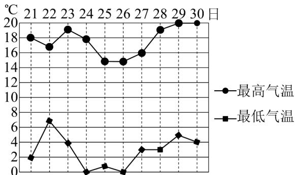

<!-- question-source:start -->
8. 某调查研究小组收集并整理了南阳市 $^{2025}$ 年 $^{11}$ 月 $^{21}$ 日至 $^{30}$ 日每日最低气温与最高气温（单位： $^{\circ}$ C）的

数据，并绘制了如图所示的折线图，则（）

A. 11月21日至30日的日最低气温的极差是 $8^{\circ}C$

B．11月21日至30日的日最高气温的中位数是 $18^{\circ}$ C

C．在 11 月 21 日至 30 日中，有 4 天的日最低气温低于 $2^{\circ}$ C

D．在 11 月 21 日至 30 日中，11 月 24 日的日温差（最高气温减最低气温）最大
<!-- question-source:end -->

![[高中/课堂同步/题库/人教A版高中数学同步讲义(2026)/02_必修第二册/第九章 统计/讲义/第九章_统计_高效培优讲义_数学人教A版高一必修第二册/强化训练_sec_11/questions/answers/Q00064951A1.md]]
