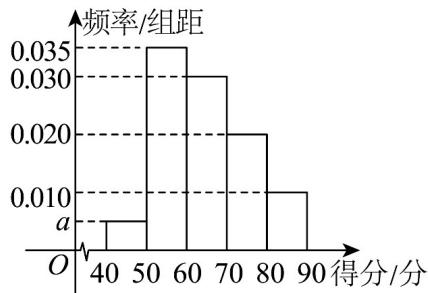

<!-- question-source:start -->
10．在一次科普知识竞赛中共有 $^{200}$ 名同学参赛，经过评判，这 $^{200}$ 名参赛者的得分都在 $[40,90]$ 之间，其得
分的频率分布直方图如图，则下列结论错误的是（）

A. 可求得 $a = 0.005$ B. 这200名参赛者得分的中位数为64 C. 得分在 $[60,80)$ 之间的频率为0.5 D. 得分在 $[40,60)$ 之间的共有80人
<!-- question-source:end -->

![[高中/课堂同步/题库/人教A版高中数学同步讲义(2026)/02_必修第二册/第九章 统计/讲义/第九章_统计_高效培优讲义_数学人教A版高一必修第二册/强化训练_sec_11/questions/answers/Q00064953A1.md]]
