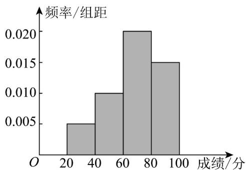

> [!faq]- 《第九章_统计_高效培优讲义_数学人教A版高一必修第二册》官方解析
>
> > [!success]- **【答案】** (1) $y=\begin{cases}60x-140,x\in[10,14]\\30x+280,x\in(14,20]\end{cases}$ (2)①698.8元；②0.54
>
> > [!note]- **【分析】**
> > （ $^{1}$ ）根据不同的需求量，整理出函数解析式；
> >
> > <!-- source-part:2 pages:51-53 -->
> >
> > (2) ①利用频率分布直方图估计平均数的方法，结合利润函数得到平均利润；②根据利润区间，换算出需求
> >
> > 量所在区间，从而找到对应的概率·
>
> > [!note]- **【解析】**
> > （1）当 $x \in [10, 14]$ 时，则 $y = 50x - 10(14 - x) = 60x - 140$ ；
> >
> > 当 $x \in (14, 20]$ 时，则 $y = 14 \times 50 + 30(x - 14) = 30x + 280$
> >
> > 综上所述： $y=\begin{cases}60x-140,x\in[10,14]\\30x+280,x\in(14,20]\cdot\end{cases}$
> >
> > (2) ①由频率分布直方图得：
> >
> > 海鲜需求量在区间 $[10,12)$ 的频率是0.16，利润为 $60\times 11 - 140 = 520$ 元；
> >
> > 海鲜需求量在区间 $[12,14)$ 的频率是0.24，利润为 $60\times 13 - 140 = 640$ 元；
> >
> > 海鲜需求量在区间 $[14,16)$ 的频率是0.30，利润为 $30\times 15 + 280 = 730$ 元；
> >
> > 海鲜需求量在区间 $[16,18)$ 的频率是0.20，利润为 $30\times 17 + 280 = 790$ 元；
> >
> > 海鲜需求量在区间 $[18,20]$ 的频率是0.10，利润为 $30\times 19 + 280 = 850$ 元；
> >
> > 所以这 $^{50}$ 天该商店销售海鲜的日利润的平均数
> >
> > $$
> > \bar {y} = 0. 1 6 \times 5 2 0 + 0. 2 4 \times 6 4 0 + 0. 3 0 \times 7 3 0 + 0. 2 0 \times 7 9 0 + 0. 1 0 \times 8 5 0 = 6 9 8. 8 (\text {元});
> > $$
> > - **②**：因为 $30 \times 14 + 280 = 60 \times 14 - 140 = 700$
> >
> > 可知 $y=\left\{\begin{aligned}&30x+280,14\leq x\leq20\\ &60x-140,10\leq x<14\end{aligned}\right.$ 在区间 $[10,20]$ 上单调递增，
> >
> > 令 $y = 580 = 60x - 140$ ，得 $x = 12$ ；令 $y = 760 = 30x + 280$ ，得 $x = 16$ ；
> >
> > 日利润 $y$ 在区间 $[580,760)$ 内的概率即求海鲜需求量 $x$ 在区间 $[12,16]$ 的频率： $0.24 + 0.30 = 0.54$
> >
> > 15．衡阳县第一中学为预备 2026 年的全国高中数学联赛预赛，在该校先选取了前 60 名的学生（含 60 名），
> >
> > $[20,40),[40,60),[60,80),[80,100]$ （本场选拔总分为 $^{100}$ 分）·
> >
> > 一中学生选拔成绩频率分布直方图
> >
> > 
> >
> > (1)估计该一中学生选拔成绩的平均值（提示：同一组中的数据用该组区间的中点值为代表）
> >
> > (2)这次选拔测试成绩的第 $^{60}$ 百分位数可估计为?
> >
> > (3)若学校定 $^{75}$ 分为标准选拔分数线，则参赛人数大约为？
> >
> > 【答案】(1)68
> >
> > (2)75
> > (3)24
> >
> > 【分析】（1）根据平均数的计算公式即可求解，
> >
> > (2) 根据百分位数的计算公式即可求解，
> >
> > (3) 根据频率即可得解·
> >
> > 【详解】（ $^{1}$ ）由图可估计选拔成绩的平均值为
> >
> > $$
> > 3 0 \times 0. 0 0 5 \times 2 0 + 5 0 \times 0. 0 1 0 \times 2 0 + 7 0 \times 0. 0 2 0 \times 2 0 + 9 0 \times 0. 0 1 5 \times 2 0 = 6 8
> > $$
> >
> > (2) 成绩位于 $\left[20,60\right)$ 的频率为 $(0.005+0.010)\times20=0.3$
> >
> > 成绩位于 $\left[20,80\right)$ 的频率为 $(0.005 + 0.010 + 0.02)\times 20 = 0.7$
> >
> > 因此第 $^{60}$ 百分位数位于 $[60,80)$ ，设为m，
> >
> > 则 $0.3 + (m - 60) \times 0.02 = 0.6$ ，故 m = 75，
> >
> > (3) 由 (2) 可知 $^{75}$ 分为第 $^{60}$ 百分位数，故能参赛的人约有 $(1 - 60\%) \times 60 = 24$ 个.
