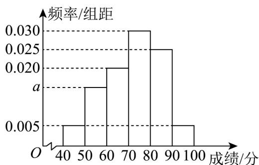

## 题型02 频率分布直方图、条形统计图、折线统计图、扇形统计图

【典例1】某中学为了解大数据提供的个性化作业质量情况，随机访问 $n$ 名学生，并对这 $n$ 名学生的个性化作业进行评分（满分： $100$ 分），其中所有学生的成绩范围是 $[40,100]$ 。根据得分将他们的成绩分成 $[40,50)$ ， $[50,60)$ ， $[60,70)$ ， $[70,80)$ ， $[80,90)$ ， $[90,100]$ 六组，制成如图所示的频率分布直方图，其中成绩在 $[70,80)$ 的学生人数为 $30$ 人。

(1)求 $a$ ， $n$ 的值；

(2)估计这 $n$ 名学生成绩的平均数（同一组数据用该组数据的中点值代替）和中位数（精确到0.01）

【答案】(1) $a = 0.015$ ， $n = 100$

(2)平均数为 72；中位数为 73.33.

【分析】（1）根据成绩在 $[70,80)$ 的学生人数为 $^{30}$ 人可求得 $n = 100$ ，再由小矩形面积之和为 $^{1}$ 可得 $a = 0.015$

(2) 利用频率分布直方图平均数求法可直接计算出结果，再由中位数定义可计算出结果.

【详解】（1）由题意可得 $n=\frac{30}{0.03\times10}=100$

易知 $10 \times (0.005 + a + 0.02 + 0.03 + 0.025 + 0.005) = 1$

解得 $a = 0.015$

(2) 平均数为 $\left(45 \times 0.005 + 55 \times 0.015 + 65 \times 0.02 + 75 \times 0.03 + 85 \times 0.025 + 95 \times 0.005\right) \times 10 = 72$ .

因为 $\left(0.005 + 0.015 + 0.02\right) \times 10 = 0.4$ ， $\left(0.005 + 0.015 + 0.02 + 0.03\right) \times 10 = 0.7$

所以中位数在 $(70,80)$ 之间，设中位数为x，

则 $(0.005+0.015+0.02)\times10+(x-70)\times0.03=0.5$ ，解得 $x\approx73.33$

即中位数为 73.33.

【典例2】某中学举行了一次“校园学科知识竞赛”，为了了解本次竞赛成绩情况，从中抽取了 $100$ 名学生的竞

赛成绩（单位：分，得分取正整数，满分为 $100$ 分）作为样本进行统计，将成绩整理后，按

$[50,60), [60,70), [70,80), [80,90), [90,100]$ 分成 $^5$ 组，得到如图所示的频率分布直方图。

(1)求 $a$ 的值；

(2)估计这次竞赛成绩的平均分（各组数据以该组区间的中点值作代表）；

(3)若该中学计划奖励竞赛成绩前 $15\%$ 的学生，求获得奖励的学生竞赛成绩的最低分。

【答案】(1)0.012

(2)76.2 分

(3)89分

【分析】（ $^{1}$ ）根据频率分布直方图的性质，结合频率和为1，列出方程，即可求解；

(2) 由频率分布直方图的平均数的计算公式，准确计算，即可求解；

(3) 由 $[90,100]$ 的频率为 $0.12$ ， $[80,90)$ 的频率为 $0.3$ ，得到前 $15\%$ 的学生的成绩位于 $[80,90)$ 之间，设获得奖

励的学生竞赛成绩的最低分为 $x$ ，列出方程，即可求解·

【详解】（1）根据频率分布直方图的性质，可得 $(a+0.018+0.028+0.030+a)\times10=1$ ，

可得 $10(2a + 0.076) = 1$ ，解得 $a = 0.012$

(2) 由 (1) 知 $a = 0.012$ ，

由频率分布直方图的平均数的计算公式，可得：

$$
\overline {{x}} = (5 5 \times 0. 0 1 2 + 6 5 \times 0. 0 1 8 + 7 5 \times 0. 0 2 8 + 8 5 \times 0. 0 3 + 9 5 \times 0. 0 1 2) \times 1 0 = 7 6. 2
$$

所以估计这次竞赛成绩的平均分 76.2 分·

(3) 由题意知，前 $15\%$ 的学生对应的频率为0.15，

因为 $[90,100]$ 的频率为 0.12， $[80,90)$ 的频率为 0.3，

所以前 $15\%$ 的学生的成绩位于[80,90)之间，

设获得奖励的学生竞赛成绩的最低分为 $x$ ，则 $x = 90 - \frac{0.15 - 0.12}{0.3} \times 10 = 89$

所以获得奖励的学生竞赛成绩的最低分为89分·

## 方法技巧

(1) 频率、频数、样本容量的计算方法

①×组距 = 频率 .

② = 频率，= 样本容量，样本容量 × 频率 = 频数。

③频率分布直方图中各个小方形的面积总和等于1.

频率分布直方图中数字特征的计算

(1) 最高的小长方形底边中点的横坐标即是众数.

(2) 中位数左边和右边的小长方形的面积和是相等的. 设中位数为 $x$ ，利用 $x$ 左（右）侧矩形面积之和等于

0.5，即可求出 $x$ ：

(3) 平均数是频率分布直方图的“重心”，等于频率分布直方图中每个小长方形的面积乘以小长方形底边中点的横坐标之和，即有 $\overline{x}=x_{1}p_{1}+x_{1}p_{1}+\cdots+x_{n}p_{n}$ ，其中 $x_{n}$ 为每个小长方形底边的中点， $p_{n}$ 为每个小长方形的面积．

![[高中/课堂同步/题库/人教A版高中数学同步讲义(2026)/02_必修第二册/第九章 统计/讲义/第九章_统计_高效培优讲义_数学人教A版高一必修第二册/_compact/Q00064938.md]]
![[高中/课堂同步/题库/人教A版高中数学同步讲义(2026)/02_必修第二册/第九章 统计/讲义/第九章_统计_高效培优讲义_数学人教A版高一必修第二册/_compact/Q00064939.md]]
![[高中/课堂同步/题库/人教A版高中数学同步讲义(2026)/02_必修第二册/第九章 统计/讲义/第九章_统计_高效培优讲义_数学人教A版高一必修第二册/_compact/Q00064940.md]]
