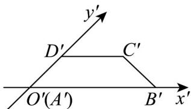

<!-- question-source:start -->
19．如图，四边形ABCD的斜二测画法直观图为等腰梯形 $A^{\prime}B^{\prime}C^{\prime}D^{\prime}$ ，已知 $A^{\prime}B^{\prime}=6$ ， $C^{\prime}D^{\prime}=4$ ，则四边形

ABCD 的周长为 \_\_\_\_ .

<!-- question-source:end -->

![[高中/课堂同步/题库/人教A版高中数学同步讲义(2026)/02_必修第二册/第八章 立体几何初步/专项训练/专题01_立体图形直观图考点的四大常考题型_高效培优专项训练_/题型一_sec_02/questions/answers/Q00064970A1.md]]
