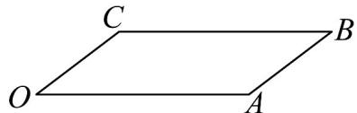

<!-- question-source:start -->
25．用斜二测画法画水平放置的正方形的直观图 OABC 如图，若在直观图中 BC = 4cm，则 AB = \_\_\_\_ cm.

<!-- question-source:end -->

![[高中/课堂同步/题库/人教A版高中数学同步讲义(2026)/02_必修第二册/第八章 立体几何初步/专项训练/专题01_立体图形直观图考点的四大常考题型_高效培优专项训练_/题型一_sec_02/questions/answers/Q00064975A1.md]]
