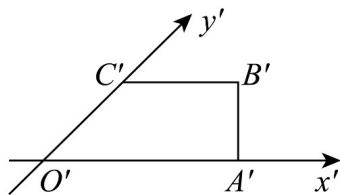

<!-- question-source:start -->
37．如图所示， $O^{\prime}A^{\prime}B^{\prime}C^{\prime}$ 为四边形OABC的斜二测直观图，其中 $O^{\prime}A^{\prime}=3$ ， $O^{\prime}C^{\prime}=1$ ， $B^{\prime}C^{\prime}=1$

(1)画出四边形OABC的平面图并标出边长，并求平面四边形OABC的面积；

(2)若该四边形 $OABC$ 以 $OA$ 为旋转轴，旋转一周，求旋转形成的几何体的体积及表面积.
<!-- question-source:end -->

![[高中/课堂同步/题库/人教A版高中数学同步讲义(2026)/02_必修第二册/第八章 立体几何初步/专项训练/专题01_立体图形直观图考点的四大常考题型_高效培优专项训练_/题型一_sec_02/questions/answers/Q00064986A1.md]]
