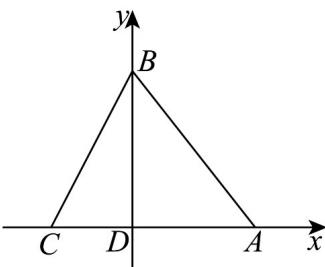
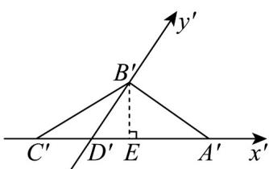

> [!faq]- 《专题01_立体图形直观图考点的四大常考题型_高效培优专项训练_》官方解析
>
> > [!success]- **【答案】** (1)作图见解析 (2) $18\sqrt{2}\left(\mathrm{cm}^{2}\right)$
>
> > [!note]- **【分析】**
> > （1）利用斜二测画法画出直观图即可；
> >
> > (2) 作 $B'E \perp A'C'$ ， $E$ 为垂足，求出 $B'E = 3\sqrt{2}$ 即可求解。
>
> > [!note]- **【解析】**
> > （1）①以 $D$ 为原点， $AC$ 所在直线为 $x$ 轴， $DB$ 所在直线为 $y$ 轴建立平面直角坐标系，如图①
> >
> > 
> > - **①**：
> > - **②**：
> > - **②**：画出对应的 $x'$ ， $y'$ 轴，使 $\angle x'D'y' = 45^\circ$
> >
> > 在 $x^{\prime}$ 轴上取点 $A^{\prime}$ ， $C^{\prime}$ ，使 $D^{\prime}A^{\prime} = DA$ ， $D^{\prime}C^{\prime} = DC$
> >
> > 在 $y'$ 轴上取点 $B'$ ，使 $D'B' = \frac{1}{2} DB$
> >
> > 连接 $A'B'$ ， $C'B'$ ，则 $\triangle A'B'C'$ 即为 $\vee ABC$ 的直观图，如图②。
> >
> > (2) 在图②中，作 $B'E \perp A'C'$ ， $E$ 为垂足，
> >
> > $\because D^{\prime}B^{\prime} = \frac{1}{2} DB = 6(\mathrm{cm})$ ， $\angle B^{\prime}D^{\prime}E = 45^{\circ}$
> >
> > $\therefore B^{\prime}E = 6\times \frac{\sqrt{2}}{2} = 3\sqrt{2}$
> >
> > $\therefore S_{\triangle A'B'C'} = \frac{1}{2} \times A'C' \times B'E = \frac{1}{2} \times 12 \times 3\sqrt{2} = 18\sqrt{2}\left(\mathrm{cm}^2\right)$
