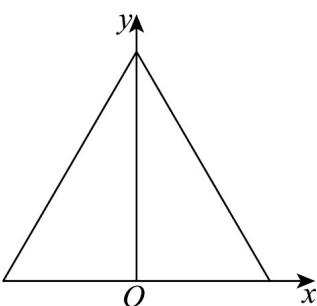
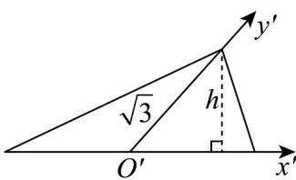
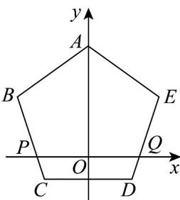
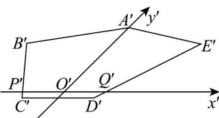
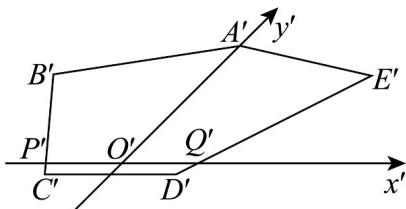

> [!faq]- 《专题01_立体图形直观图考点的四大常考题型_高效培优专项训练_》官方解析
>
> > [!success]- **【答案】** A. $\frac{\sqrt{2}}{4}$ B. $\frac{\sqrt{6}}{4}$ C. $\sqrt{6}$ D. $2\sqrt{6}$
>
> > [!note]- **【分析】**
> > 根据直观图与原图的关系，可确定直观图（三角形）的底和高，从而求得直观图的面积，得出答案：
>
> > [!note]- **【解析】**
> > 
> >
> > 
> >
> > 如图所示，正三角形的边长为4，则高为 $4\times\sin60^{\circ}=2\sqrt{3}$ ，
> > 根据斜二测画法的知识，则直观图中三角形的高为 $h=\frac{\sqrt{3}}{\sqrt{2}}$ ，底边长为4，
> > 所以直观图的面积为 $\frac{1}{2}\times4\times\frac{\sqrt{3}}{\sqrt{2}}=\sqrt{6}$ .
> >
> > 故选：C.
> >
> > 4．如下图，已知图2为甲同学用斜二测画法作出的在平面直角坐标系中正五边形 $ABCDE$ （见图1）的直观图即五边形 $A'B'C'D'E'$ ，且保持坐标轴上的单位长度不变，其中各点的作法可能正确的为（）
> >
> > 【答案】
> >
> > 
> > 图1
> >
> > 
> > 图2
> >
> > A. $A^{\prime},B^{\prime},P^{\prime}$ B. $B^{\prime},P^{\prime},C^{\prime}$ C. $P^{\prime},C^{\prime},D^{\prime}$ D. $D^{\prime},E^{\prime},A^{\prime}$
> >
> > 【答案】C
> > 【分析】根据斜二测画法的规则，即可得出结论.
> > 【详解】斜二侧画直观图时，平行或与 $x$ 轴重合的线段长度不变，则 $CD, PQ$ 长度不变，平行或与 y 轴重合的线段长度减半，则 OA 减掉一半，线段 PB, PC, QE, QD 对应线段也会缩小，如图所示：
> >
> > 
> >
> > 所以 P, C, D, Q 的对应点 $P', C', D', Q'$ 画对了, A, B, E 的对应点 $A', B', E'$ 画错了.
> >
> > 故选 **C**.
