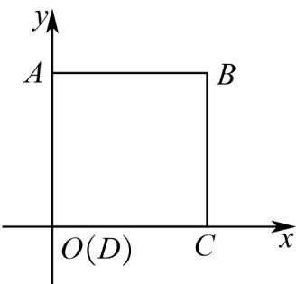
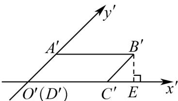
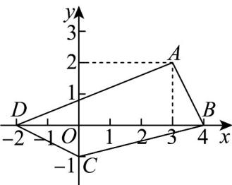
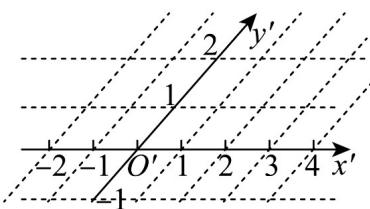
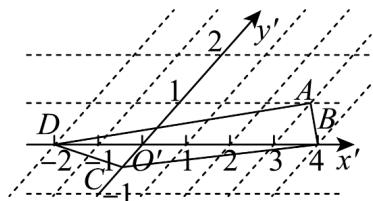

> [!faq]- 《专题01_立体图形直观图考点的四大常考题型_高效培优专项训练_》官方解析
>
> > [!success]- **【答案】** 
>
> > [!note]- **【分析】**
> > 作出正方形 ABCD 的直观图 $A'B'C'D'$ ，再结合斜二测画法的规则计算可得.
>
> > [!note]- **【解析】**
> > 作出正方形 ABCD 的直观图 $A'B'C'D'$ 如图所示：
> >
> > 
> >
> > 因为 $O'A' = B'C' = 1$ ， $\angle B'C'x' = 45^{\circ}$
> >
> > 所以顶点 $B^{\prime}$ 到 $x^{\prime}$ 轴的距离为 $1\times \sin 45^{\circ} = \frac{\sqrt{2}}{2}$
> >
> > 故答案为： $\frac{\sqrt{2}}{2}$
> >
> > 6. 画出图中水平放置的四边形 $ABCD$ 的直观图 $A'B'C'D'$ ，并求出直观图中三角形 $B^{\Phi}C^{\Phi}D^{\Phi}$ 的面积.
> >
> > 
> >
> > 
> >
> > 【答案】答案见解析， $\forall B^{\prime}C^{\prime}D^{\prime}$ 的面积为 $\frac{3\sqrt{2}}{4}$
> >
> > 【分析】根据斜二测画法的规则，即可求得四边形 $ABCD$ 的直观图 $A'B'C'D'$
> >
> > 【详解】根据题意，结合斜二测画法的规则，可得水平放置的四边形 $ABCD$ 的直观图 $A'B'C'D'$
> >
> > 如图所示，则 $\bigvee B^{\prime}C^{\prime}D^{\prime}$ 的面积为 $S_{\triangle B^{\prime}C^{\prime}D^{\prime}} = \frac{1}{2}\times 6\times \frac{1}{2}\times \frac{\sqrt{2}}{2} = \frac{3\sqrt{2}}{4}$
> >
> > 
