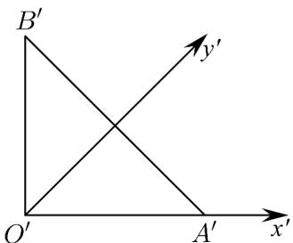
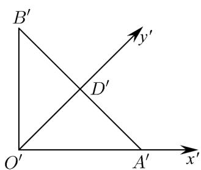
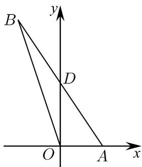

> [!faq]- 《专题01_立体图形直观图考点的四大常考题型_高效培优专项训练_》官方解析
>
> > [!success]- **【答案】**  A. $2\sqrt{3}$ B.4 C. $4\sqrt{3}$ D. $2\sqrt{6}$
>
> > [!note]- **【分析】**
> > 根据斜二测画法的规则，即可得 $\triangle OAB$ 的原图，根据长度关系即可求解.
>
> > [!note]- **【解析】**
> > 根据题意可得 $\triangle OAB$ 的原图如图所示，其中 $D$ 为 $AB$ 的中点，
> >
> > 由于 $D^{\Phi}$ 为 $A'B'$ 的中点， $O'D' = \sqrt{2}$ ，
> >
> > 且 $OA = 2$ ， $OD = 2O^{\prime}D^{\prime} = 2\sqrt{2}$ ， $AD = \sqrt{OA^2 + OD^2} = 2\sqrt{3}$ ，故 $AB = 2AD = 4\sqrt{3}$
> >
> > 故选：C
> >
> > 
> >
> > 
