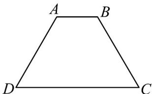
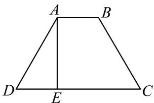

> [!faq]- 《专题01_立体图形直观图考点的四大常考题型_高效培优专项训练_》官方解析
>
> > [!success]- **【答案】** 
>
> > [!note]- **【分析】**
> > 根据斜二测画法的性质结合梯形面积公式即可求解.
>
> > [!note]- **【解析】**
> > 由题意可知等腰梯形 $ABCD$ 的高 $AE = \sqrt{AD^{2} - DE^{2}} = \sqrt{AD^{2} - \left(\frac{DC - AB}{2}\right)^{2}} = \sqrt{4 - 1} = \sqrt{3}$ ,由斜二测画法的规则可知：该梯形直观图中的高为 $\frac{1}{2} AE\sin 45^{\circ} = \frac{1}{2}\times \sqrt{3}\times \frac{\sqrt{2}}{2} = \frac{\sqrt{6}}{4}$ $AB,CD$ 的长度在直观图中与原图保持一致，故直观图的面积为 $\frac{1}{2}(1 + 3)\times \frac{\sqrt{6}}{4} = \frac{\sqrt{6}}{2}$ 故答案为： $\frac{\sqrt{6}}{2}$
> >
> > 
> >
> > 题型二：直观图还原几何图形
