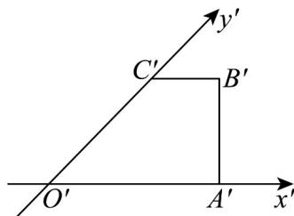
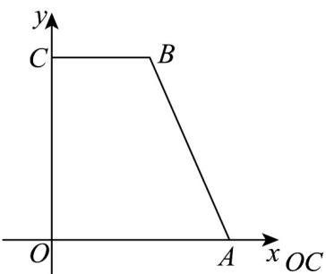

> [!faq]- 《专题01_立体图形直观图考点的四大常考题型_高效培优专项训练_》官方解析
>
> > [!success]- **【答案】** 
>
> > [!note]- **【分析】**
> > 画出直观图，结合斜二测画法的定义得到答案.
>
> > [!note]- **【解析】**
> > 画出直观图如下：
> >
> > 
> >
> > 为该平面图形的高，
> >
> > $$
> > O C = 2 O ^ {\prime} C ^ {\prime} = 4 \sqrt {2}
> > $$
> >
> > 故答案为： $4\sqrt{2}$
