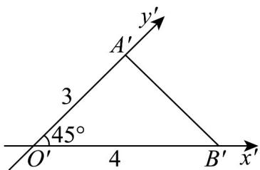
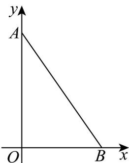

> [!faq]- 《专题01_立体图形直观图考点的四大常考题型_高效培优专项训练_》官方解析
>
> > [!success]- **【答案】**  A.6 B.9 C.12 D.15
>
> > [!note]- **【分析】**
> > 根据直观图还原原图形，然后可求出 $\triangle OAB$ 的面积.
>
> > [!note]- **【解析】**
> > 由 $\triangle OAB$ 的直观图可知原图中， $\angle AOB = 90^{\circ}, OA = 6, OB = 4$
> >
> > 所以 $\triangle OAB$ 的面积为 $\frac{1}{2}, 4, 6 = 12$ .
> >
> > 
> >
> > 故选 **C**
