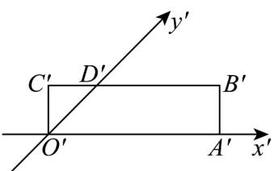
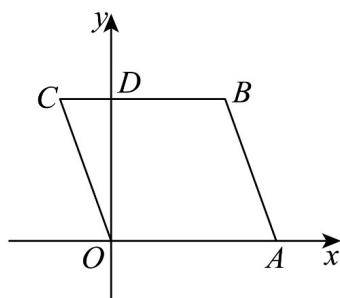

> [!faq]- 《专题01_立体图形直观图考点的四大常考题型_高效培优专项训练_》官方解析
>
> > [!success]- **【答案】**  A. 正方形 B. 矩形 C. 菱形 D. 梯形
>
> > [!note]- **【分析】**
> > 根据直观图与原图的关系即可得解.
>
> > [!note]- **【解析】**
> > 因为矩形 $O'A'B'C'$ 中 $O'A' // B'C', O'A' = B'C'$
> >
> > 所以直观图还原得 $OA // BC, OA = BC = O'A' = 6$
> >
> > 四边形 $OABC$ 为平行四边形， $OD \perp BC$
> >
> > 则 $C^{\prime}D^{\prime} = O^{\prime}C^{\prime} = 2$ ，所以 $CD = 2$
> >
> > $O^{\prime}D^{\prime} = \sqrt{2} O^{\prime}C^{\prime} = 2\sqrt{2},OD = 2O^{\prime}D^{\prime} = 4\sqrt{2}$
> >
> > $$
> > O C = \sqrt {C D ^ {2} + O D ^ {2}} = \sqrt {2 ^ {2} + (4 \sqrt {2}) ^ {2}} = 6
> > $$
> >
> > 
> >
> > 所以 OC = OA = 6 ，故原图形为菱形.
> >
> > 故选 **C**.
