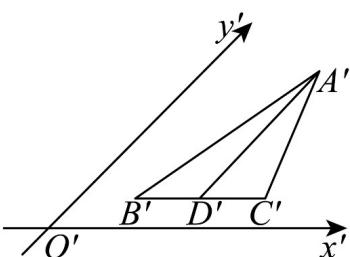
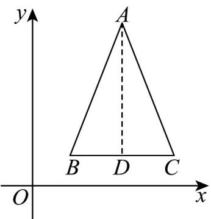

> [!faq]- 《专题01_立体图形直观图考点的四大常考题型_高效培优专项训练_》官方解析
>
> > [!success]- **【答案】**  A．最长的是 $AB$ ，最短的是 $AC$ B．最长的是 $AC$ ，最短的是 $AB$ C．最长的是 $AB$ ，最短的是 $AD$ D．最长的是 $AD$ ，最短的是 $AC$
>
> > [!note]- **【分析】**
> > 根据斜二测画法还原平面图形可知结果.
>
> > [!note]- **【解析】**
> > 因为 $A^{\prime}D^{\prime} / / y^{\prime}$ 轴，所以在 $\forall ABC$ 中， $AD \perp BC$
> >
> > 又因为 $D^{\phi}$ 是 $B^{\prime}C^{\prime}$ 的中点，所以 $D$ 是 $BC$ 中点，
> >
> > 
> >
> > 所以 $\vee ABC$ 为等腰三角形，有 $AB = AC > AD$
> >
> > 故选：C.
> >
> > 题型三：斜二测求长度
