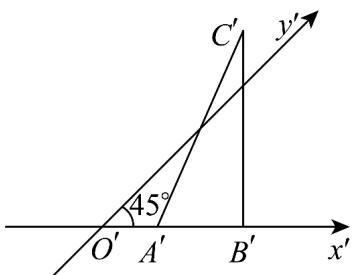
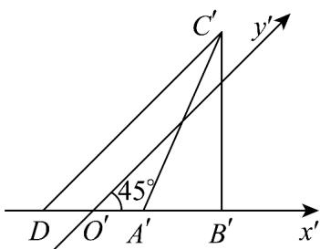

> [!faq]- 《专题01_立体图形直观图考点的四大常考题型_高效培优专项训练_》官方解析
>
> > [!success]- **【答案】**  A.3 B. $3\sqrt{2}$ C.6 D. $6\sqrt{2}$
>
> > [!note]- **【分析】**
> > 利用斜二测画法还原 $\triangle ABC$ ，计算边AB上的高.
>
> > [!note]- **【解析】**
> > 如图，作线段 $C^{\prime}D//y^{\prime}$ 轴，交 $x^{\prime}$ 轴于点D，
> > 则 $C'D=\frac{B'C'}{\sin45^{\circ}}=\frac{3}{\frac{\sqrt{2}}{2}}=3\sqrt{2}$ 所以边 AB 上的高为 $2C'D = 6\sqrt{2}$ .
> > 故选：D.
> >
> > 
