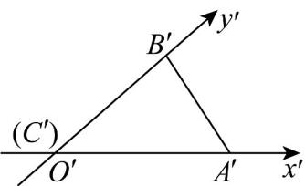
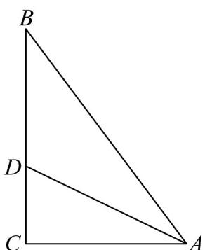

> [!faq]- 《专题01_立体图形直观图考点的四大常考题型_高效培优专项训练_》官方解析
>
> > [!success]- **【答案】**  A. $2\sqrt{13}$ B. $3\sqrt{3}$ C. $4\sqrt{3}$ D. $3\sqrt{5}$
>
> > [!note]- **【分析】**
> > 由 $\forall ABC$ 的直观图可得 $AC = 6$ ， $BC = 8$ ， $AB = 10$ ，再利用角平分线定理可求得 $CD = 3$ ，再由勾股定理可得结论.
>
> > [!note]- **【解析】**
> > 易知 $\forall ABC$ 为直角三角形，且 $AC = 6$ ， $BC = 8$ ，由勾股定理可得 $AB = 10$
> >
> > 设角 A 的角平分线交 BC 于 D，如下图所示：
> >
> > 
> >
> > 根据角平分线性质知 $CD:DB = AC:AB = 6:10$
> >
> > 又因为 BC = 8 ，所以 CD = 3 ，DB = 5 ，
> >
> > 所以 $AD = \sqrt{AC^{2} + CD^{2}} = \sqrt{6^{2} + 3^{2}} = 3\sqrt{5}$
> >
> > 故选 **D**.
