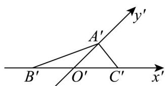
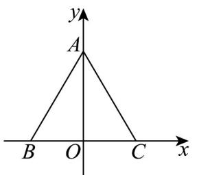

> [!faq]- 《专题01_立体图形直观图考点的四大常考题型_高效培优专项训练_》官方解析
>
> > [!success]- **【答案】** 
>
> > [!note]- **【分析】**
> > 由斜二测画法求解即可.
>
> > [!note]- **【解析】**
> > 如图所示：原图为：
> >
> > 
> >
> > 由斜二测画法得， $\left|BO\right|=\left|CO\right|=1,\left|AO\right|=\sqrt{3},AO\perp BC$
> >
> > 得 $|AB| = |AC| = \sqrt{|AO|^2 + |CO|^2} = 2$
> >
> > 则 $|AB| = |AC| = |BC|$
> >
> > 故VABC为等边三角形，
> >
> > 故答案为：等边三角形
