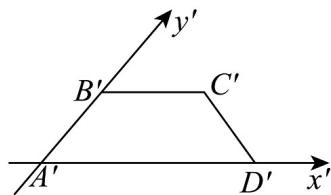
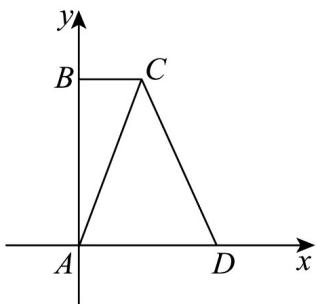

> [!faq]- 《专题01_立体图形直观图考点的四大常考题型_高效培优专项训练_》官方解析
>
> > [!success]- **【答案】** 
>
> > [!note]- **【分析】**
> > 画出原图形，由勾股定理求出答案.
>
> > [!note]- **【解析】**
> > 根据题意，由直观图知原几何图形是直角梯形ABCD，如图，
> >
> > 
> >
> > 由斜二测法则知 $AB = 2A'B' = 2$ ， $BC = B'C' = 1$ ，
> >
> > 所以 $AC = \sqrt{AB^2 + BC^2} = \sqrt{4 + 1} = \sqrt{5}$
> >
> > 故答案为： $\sqrt{5}$
> >
> > 题型四：斜二测求面积
