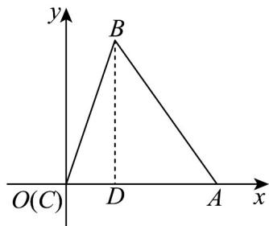
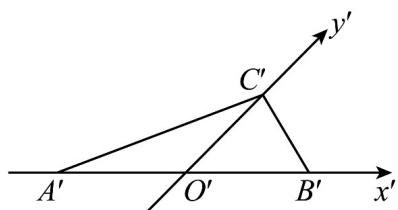
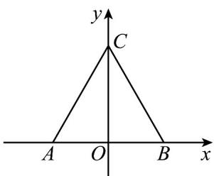
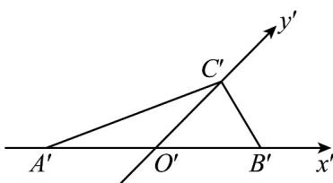

> [!faq]- 《专题01_立体图形直观图考点的四大常考题型_高效培优专项训练_》官方解析
>
> > [!success]- **【答案】** （1）答案见解析；（2）3
>
> > [!note]- **【分析】**
> > （1）根据斜二测画法的规则进行作图即可；
> >
> > (2) 根据斜二测画法的规则：平行 $x$ 轴的线段长度不变，平行 $y$ 轴的线段长度减半，由此可求出原 $\vee ABC$ 的面积.
>
> > [!note]- **【解析】**
> > （1）画法：①画直角坐标系 $xOy$ ，在 $x$ 轴上取 $OA = O'A'$ ，即 $CA = C'A'$ ；
> > - **②**：在题图中，过 $B'$ 作 $B'D' // y'$ 轴，交 $x'$ 轴于 $D\Phi$ ，在 $x$ 轴上取 $OD = O'D'$ ，过 $D$ 作 $DB // y$ 轴，并使 $DB = 2D'B'$ ；
> > - **③**：连接 $AB, BC$ ，则 $\forall ABC$ 即为 $\triangle A'B'C'$ 原来的图形，如图。
> >
> > 
> >
> > (2) $\because B^{\prime}D^{\prime} / / y^{\prime},\therefore BD\perp AC.$
> >
> > 又 $|B'D'|=1.5$ 且 $|A'C'|=2$
> >
> > $$
> > \therefore | B D | = 3, | A C | = 2,
> > $$
> >
> > $$
> > \therefore S _ {\triangle A B C} = \frac {1}{2} | B D | \cdot | A C | = 3.
> > $$
> >
> > 33. 正三角形 $ABC$ 的边长为 $2\mathrm{cm}$ ，如图， $\triangle A'B'C'$ 为其水平放置的直观图，则（）
> >
> > 【答案】
> >
> > 
> >
> > A. $\triangle A'B'C'$ 为锐角三角形
> >
> > B. $\triangle A'B'C'$ 的面积为 $2\sqrt{6}\mathrm{cm}^2$
> >
> > C. $\triangle A'B'C'$ 的周长为 $\left(2 + \sqrt{6}\right)\mathrm{cm}$
> >
> > D. $\triangle A'B'C'$ 的面积为 $\frac{\sqrt{6}}{4}\mathrm{cm}^2$
> >
> > 【答案】CD
> >
> > 【分析】根据斜二测法可求出 $A^{\prime}B^{\prime}=2, O^{\prime}C^{\prime}=\frac{\sqrt{3}}{2}$ ， $\angle C^{\prime}O^{\prime}B^{\prime}=45^{\circ}$ ，再利用余弦定理可求出 $\left|A^{\prime}C^{\prime}\right|,\left|B^{\prime}C^{\prime}\right|$ ，再逐一对各个选项分析判断即可求出结果.
> >
> > 【详解】如图，因为正三角形 $ABC$ 的边长为 $2\mathrm{cm}$ ，故 $OC = \sqrt{3}$
> >
> > 所以 $A^{\prime}B^{\prime}=2, O^{\prime}C^{\prime}=\frac{\sqrt{3}}{2}$ ， $\angle C^{\prime}O^{\prime}B^{\prime}=45^{\circ}$ ，
> >
> > 在 $\triangle A^{\prime}O^{\prime}C^{\prime}$ 中， $O^{\prime}A^{\prime} = 1,O^{\prime}C^{\prime} = \frac{\sqrt{3}}{2},\angle A^{\prime}O^{\prime}C^{\prime} = 135^{\circ}$ ，由余弦定理得：
> >
> > $$
> > \left| A ^ {\prime} C ^ {\prime} \right| ^ {2} = \left| O ^ {\prime} A ^ {\prime} \right| ^ {2} + \left| O ^ {\prime} C ^ {\prime} \right| ^ {2} - 2 \left| O ^ {\prime} A ^ {\prime} \right| \cdot \left| O ^ {\prime} C ^ {\prime} \right| \cos \angle A ^ {\prime} O ^ {\prime} C ^ {\prime}
> > $$
> >
> > $= 1 + \frac{3}{4} -2\times 1\times \frac{\sqrt{3}}{2}\times \left(-\frac{\sqrt{2}}{2}\right) = \frac{7}{4} +\frac{\sqrt{6}}{2}$
> >
> > 在 $\triangle B^{\prime}O^{\prime}C^{\prime}$ 中， $O^{\prime}B^{\prime} = 1, O^{\prime}C^{\prime} = \frac{\sqrt{3}}{2}, \angle B^{\prime}O^{\prime}C^{\prime} = 45^{\circ}$ ，由余弦定理得：
> >
> > $$
> > \left| B ^ {\prime} C ^ {\prime} \right| ^ {2} = \left| O ^ {\prime} B ^ {\prime} \right| ^ {2} + \left| O ^ {\prime} C ^ {\prime} \right| ^ {2} - 2 \left| O ^ {\prime} B ^ {\prime} \right| \cdot \left| O ^ {\prime} C ^ {\prime} \right| \cos \angle B ^ {\prime} O ^ {\prime} C ^ {\prime}
> > $$
> >
> > $$
> > = 1 + \frac {3}{4} - 2 \times 1 \times \frac {\sqrt {3}}{2} \times \frac {\sqrt {2}}{2} = \frac {7}{4} - \frac {\sqrt {6}}{2}
> > $$
> >
> > 在 $\triangle A'B'C'$ 中，因为 $\left|B'C'\right|^2 +\left|A'C'\right|^2 -\left|A'B'\right|^2 = \frac{7}{4} -\frac{\sqrt{6}}{2} +\frac{7}{4} +\frac{\sqrt{6}}{2} -4 = -\frac{1}{2} < 0$
> >
> > 由余弦定理知 $\cos\angle A^{\prime}C^{\prime}B^{\prime}=\frac{\left|B^{\prime}C^{\prime}\right|^{2}+\left|A^{\prime}C^{\prime}\right|^{2}-\left|A^{\prime}B^{\prime}\right|^{2}}{2\left|B^{\prime}C^{\prime}\right|\cdot\left|A^{\prime}C^{\prime}\right|}<0$ ，故 A 错误；
> >
> > 又因为 $S_{\triangle A'B'C'} = \frac{1}{2}\left|A'B'\right|\cdot \left|O'C'\right|\sin 45^\circ = \frac{1}{2}\times 2\times \frac{\sqrt{3}}{2}\times \frac{\sqrt{2}}{2} = \frac{\sqrt{6}}{4}$ ，故B错误，D正确；
> >
> > $\triangle A^{\prime}B^{\prime}C^{\prime}$ 的周长为： $L = \left|A^{\prime}B^{\prime}\right| + \left|B^{\prime}C^{\prime}\right| + \left|C^{\prime}A^{\prime}\right| = 2 + \sqrt{\frac{7}{4} + \frac{\sqrt{6}}{2}} +\sqrt{\frac{7}{4} - \frac{\sqrt{6}}{2}}$
> >
> > $= 2 + \sqrt{\left(\frac{\sqrt{6}}{2} + \frac{1}{2}\right)^{2}} +\sqrt{\left(\frac{\sqrt{6}}{2} - \frac{1}{2}\right)^{2}} = 2 + \sqrt{6}$ ，故C正确.
> >
> > 
> >
> > 故选：CD.
> >
> > 
