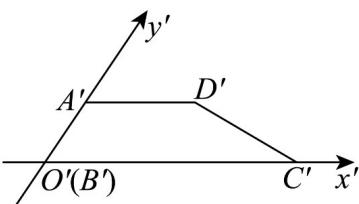
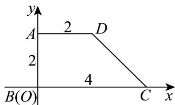

> [!faq]- 《专题01_立体图形直观图考点的四大常考题型_高效培优专项训练_》官方解析
>
> > [!success]- **【答案】**  A. $AD$ 线段平行于 $x$ 轴 B. $AB = 2$ C. 梯形 $ABCD$ 是直角梯形 D. 梯形 $ABCD$ 的面积是3
>
> > [!note]- **【分析】**
> > 将直观图还原为原图形，得到各边长和梯形面积，即可进行判断.
>
> > [!note]- **【解析】**
> > 
> >
> > 直观图 $A'B'C'D'$ 还原为原图形，是直角梯形 ABCD
> >
> > 如图，其中 $AD = A'D' = 2$ ， $BC = B'C' = 4$ ， $AB = 2A'B' = 2$ ，AD 线段平行于 x 轴，故 ABC 正确；
> >
> > 梯形ABCD的面积为 $\frac{1}{2} \times (2 + 4) \times 2 = 6$ ，故D错误；
> >
> > 故选 **ABC**.
