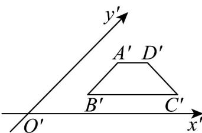
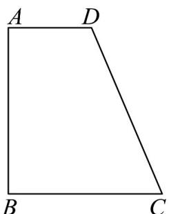

> [!faq]- 《专题01_立体图形直观图考点的四大常考题型_高效培优专项训练_》官方解析
>
> > [!success]- **【答案】** 
>
> > [!note]- **【分析】**
> > 由斜二侧画法可知，原图为直角梯形，上底为1，高为2，下底为 $1+\sqrt{2}$ ，利用梯形面积公式求解即可．
>
> > [!note]- **【解析】**
> > 根据斜二侧画法可知，原图形为直角梯形，如图，
> >
> > 
> >
> > 其中上底 $AD = 1$ ，高 $AB = 2A'B' = 2$ ，下底为 $BC = 1 + \sqrt{2}$
> >
> > $\therefore S = \frac{1 + 1 + \sqrt{2}}{2} \times 2 = 2 + \sqrt{2}$
> >
> > 故答案为： $2 + \sqrt{2}$
