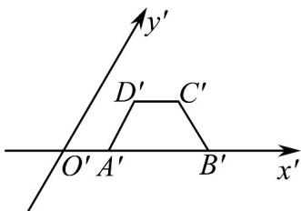
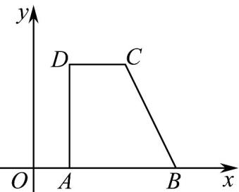

> [!faq]- 《专题01_立体图形直观图考点的四大常考题型_高效培优专项训练_》官方解析
>
> > [!success]- **【答案】**  A.6 B.3 C.8 D.4
>
> > [!note]- **【分析】**
> > 根据直观图画法的规则，确定原平面图形四边形ABCD的形状，求出上下底边边长，以及高，然后求出面积.
>
> > [!note]- **【解析】**
> > 根据直观图画法的规则，直观图中 $A^{\prime}D^{\prime}$ 平行于 $y^{\prime}$ 轴， $A^{\prime}D^{\prime}=1$ ， $A^{\prime}B^{\prime}$ 在 $x^{\prime}$ 轴上， $A^{\prime}B^{\prime}\parallel D^{\prime}C^{\prime}$ ， $A^{\prime}B^{\prime}=3$ ， $C^{\prime}D^{\prime}=1$ ，
> >
> > 则原平面图形 ABCD 中 AD 平行于 y 轴，AB 在 x 轴上， $AB \parallel DC$
> >
> > 从而有 $AD \perp AB$ ，且 $AD = 2A'D' = 2$ ，AB = 3，CD = 1，如图所示，
> >
> > 
> >
> > 故选：D.
> >
> > 所以直角梯形 ABCD 的面积为 $S = \frac{2(1 + 3)}{2} = 4$ .
