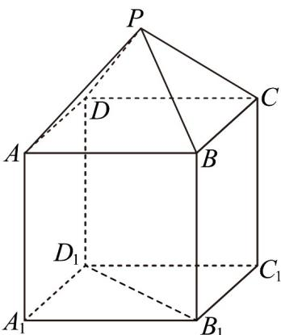

<!-- question-source:start -->
8．如图，P-ABCD 是正四棱锥， $ABCD-A_{1}B_{1}C_{1}D_{1}$ 是正方体，其中 AB=2， $PA=\sqrt{6}$ ，则该几何体的表面积 \_\_\_\_；

<!-- question-source:end -->

![[高中/课堂同步/题库/人教A版高中数学同步讲义(2026)/02_必修第二册/第八章 立体几何初步/专项训练/专题02_棱柱_棱锥_棱台表面积与体积的六大常考题型_高效培优专项训练/题型一_sec_02/questions/answers/Q00064995A1.md]]
