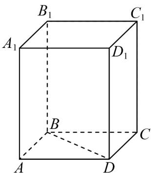
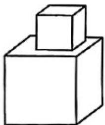

> [!faq]- 《专题02_棱柱_棱锥_棱台表面积与体积的六大常考题型_高效培优专项训练》官方解析
>
> > [!success]- **【答案】** 
>
> > [!note]- **【分析】**
> > 求出正四棱柱的侧棱长和底面边长后即可求表面积.
>
> > [!note]- **【解析】**
> > 因为四边形 ABCD 为正方形， $BD = 4\sqrt{2}$ ，故 BA = 4
> >
> > 而 $DB_{1} = \sqrt{41}$ ，故 $BB_{1}^{2} + BD^{2} = BB_{1}^{2} + (4\sqrt{2})^{2} = 41$ ，故 $BB_{1} = 3$
> >
> > 故正四棱柱的表面积为 $2 \times 4^{2} + 4 \times 4 \times 3 = 80$ .
> >
> > 故答案为：80.
> >
> > 3. 两个棱长分别为 1 和 2 的正方体叠起来得到如图所示的几何体，该几何体的表面积为 \_\_\_\_。
> >
> > 【答案】
> >
> > 
> >
> > 【答案】28
> >
> > 【分析】根据正方体表面积公式计算求解.
> >
> > 【详解】因为两个棱长分别为 1 和 2 正方体叠起来得到的几何体，
> >
> > 该几何体的表面积为 $6 \times 4 + 6 \times 1 - 2 \times 1 = 28$
> >
> > 故答案为：28
