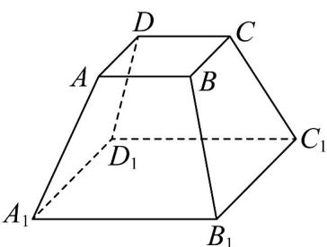
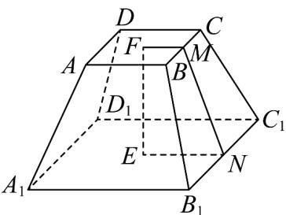

> [!faq]- 《专题02_棱柱_棱锥_棱台表面积与体积的六大常考题型_高效培优专项训练》官方解析
>
> > [!success]- **【答案】**  A.160元 B.128元 C.97.5元 D.86.875元
>
> > [!note]- **【分析】**
> > 由勾股定理求得斜高，根据正四棱台的表面积计算，可得答案.
>
> > [!note]- **【解析】**
> > 由题意，分别取上下底面的中心为 $F, E$ ，分别取 $BC, B_{1}C_{1}$ 的中点为 $M, N$ ，连接 $EF, FM, MN, NE$ ，如下图：
> >
> > 
> >
> > 则 $FM = \frac{1}{2} AB = 2$ ， $EN = \frac{1}{2} A_1B_1 = 5$ ， $EF = 4$
> >
> > 易知 $MN = \sqrt{EF^2 + (EN - FM)^2} = \sqrt{4^2 + 3^2} = 5$
> >
> > 根据题意可得正四棱台的斜高为5
> >
> > 所以正四棱台的表面积为 $16 + 100 + 4 \times \frac{1}{2} \times (4 + 10) \times 5 = 256$
> >
> > 所以该零部件的防腐处理费用是 $256 \times 0.5 = 128$ 元.
> >
> > 故选 **B**.
