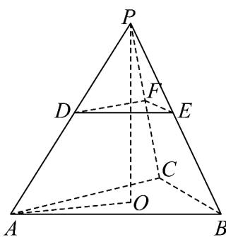

> [!faq]- 《专题02_棱柱_棱锥_棱台表面积与体积的六大常考题型_高效培优专项训练》官方解析
>
> > [!success]- **【答案】** A. $4\sqrt{3}$ B. $5\sqrt{6}$ C. $\frac{7\sqrt{17}}{4}$ D. $\frac{9\sqrt{39}}{4}$
>
> > [!note]- **【分析】**
> > 将正棱台补全为棱锥，求出棱锥、棱台的高，确定上底面的位置，求出棱锥侧面积，进而求出棱台的侧面积.
>
> > [!note]- **【解析】**
> > 将正棱台 ABC-DEF 补全为正三棱锥 P-ABC，O 为底面中心，
> >
> > 
> >
> > $$
> > A B = 2 \sqrt {3}, A D = 2, \angle P A O = \frac {\pi}{3}
> > $$
> >
> > $$
> > A O = \frac {2}{3} \times \frac {\sqrt {3}}{2} \times 2 \sqrt {3} = 2
> > $$
> >
> > $$
> > P O = 2 \sqrt {3}
> > $$
> >
> > 棱台的高 $h = AD\sin \frac{\pi}{3} = \sqrt{3} = \frac{1}{2} PO$ ，棱台上底面DEF是正三棱锥 $P - ABC$ 的中截面， $PB = PC = PA = 2AD = 4$ ，等腰 $\triangle PAB$ 高为 $\sqrt{PA^2 - (\frac{1}{2} AB)^2} = \sqrt{13}$ 面积为 $S_{\triangle PAB} = \frac{1}{2} \times 2\sqrt{3} \times \sqrt{13} = \sqrt{39}$ ，等腰梯形ABED的面积为 $\frac{3}{4} S_{\triangle PAB} = \frac{3\sqrt{39}}{4}$ 所以该三棱台的侧面积为 $\frac{9\sqrt{39}}{4}$ .
> >
> > 故选 **D**
