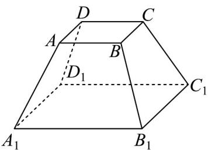
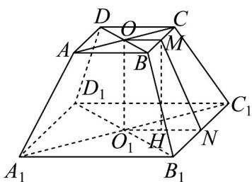
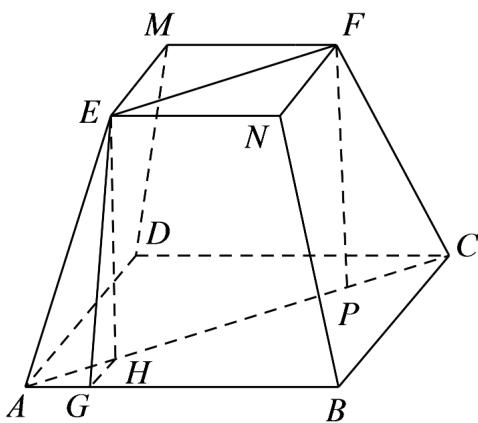
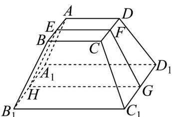

> [!faq]- 《专题02_棱柱_棱锥_棱台表面积与体积的六大常考题型_高效培优专项训练》官方解析
>
> > [!success]- **【答案】**  A.640元 B.440元 C.390元 D.347.5元
>
> > [!note]- **【分析】**
> > 根据棱台的高求出侧面等腰梯形的高，再计算出棱台的表面积，即可求得该零部件的防腐处理费用.
>
> > [!note]- **【解析】**
> > 
> >
> > 如图所示， $AC\cap BD = O$ ， $A_{1}C_{1}\cap B_{1}D_{1} = O_{1}$ ，连接 $OO_{1}$ ， $M,N$ 分别是 $BC,B_{1}C_{1}$ 的中点，连接 $OM,MN,O_1N$ ，取 $O_{1}N$ 的中点 $H$ ，连接 $MH$
> >
> > 由题意，在正四棱台 $ABCD - A_1B_1C_1D_1$ 中， $OO_1 \perp$ 平面 $A_1B_1C_1D_1$ ，则 $OO_1 = 12$ ，因为 $O, M$ 分别是 $AC, BC$ 的中点，所以 $OM // AB$ ，且 $OM = \frac{1}{2} AB = 5$ ，又 $O_1, N$ 分别是 $A_1C_1, B_1C_1$ 的中点，所以 $O_1N // A_1B_1$ ，且 $O_1N = \frac{1}{2} A_1B_1 = 10$ ，故 $OM // O_1N$ ，则 $O, M, N, O_1$ 四点共面；因为 $OO_1 \perp$ 平面 $A_1B_1C_1D_1$ ， $O_1N \subset$ 平面 $A_1B_1C_1D_1$ ，所以 $OO_1 \perp O_1N$ ，所以四边形 $OMNO_1$ 为直角梯形，在直角梯形 $OMNO_1$ 中， $OM = \frac{1}{2} O_1N$ ，又点 $H$ 是 $O_1N$ 的中点，所以四边形 $OMHO_1$ 为矩形，则 $MH \perp O_1N$ ，且 $MH = OO_1 = 12$ ，又 $HN = \frac{1}{2} O_1N = 5$ 因此，在直角 $\triangle MHN$ 中， $MN = \sqrt{MH^2 + HN^2} = 13$ ，所以在正四棱台 $ABCD - A_1B_1C_1D_1$ 中，侧面积 $S_1 = 4 \times \left[\frac{1}{2} \times (BC + B_1C_1) \times MN\right] = 4 \times \left[\frac{1}{2} \times (10 + 20) \times 13\right] = 780$ ，底面积 $S_2 = AB^2 + A_1B_1^2 = 10^2 + 20^2 = 500$ ，表面积 $S = S_1 + S_2 = 780 + 500 = 1280$ （平方厘米），又每平方厘米的防腐处理费用为 0.5 元，所以该零部件的防腐处理费用是 $1280 \times 0.5 = 640$ （元）.
> >
> > 故选：A
> >
> > 20．正四棱台的上、下底面的边长分别为 2,4，高为 $\sqrt{3}$ ，则其侧面积为（）
> >
> > 【答案】
> > A.20 B.24 C. $12\sqrt{3}$ D. $24\sqrt{3}$
> >
> > 【答案】B
> >
> > 【分析】作出辅助线，求出侧高，得到侧面积.
> >
> > 【详解】如图，过点 $E, F$ 分别作 $EH \perp AC$ ， $FP \perp AC$ ，垂足分别为 $H, P$
> >
> > 其中 $EF = 2\sqrt{2}, AC = 4\sqrt{2}$ ，故 $HP = EF = 2\sqrt{2}$
> >
> > 所以 $AH = CP = \sqrt{2}$
> >
> > 又 $EH = FP = \sqrt{3}$ ，由勾股定理得 $AE = \sqrt{AH^2 + EH^2} = \sqrt{2 + 3} = \sqrt{5}$ 其中 $AG = \frac{AB - EN}{2} = 1$ ，由勾股定理得 $EG = \sqrt{AE^2 - AG^2} = 2$ 故梯形 $AENB$ 的面积为 $\frac{(EN + AB)\cdot EG}{2} = \frac{(2 + 4)\times 2}{2} = 6$ 其侧面积为 $4\times 6 = 24$
> >
> > 
> >
> > 故选：B
> >
> > 21．正四棱台 $ABCD-A_{1}B_{1}C_{1}D_{1}$ 中，上底面边长为 2，下底面边长为 4，若侧面与底面所成的二面角为 $60^{\circ}$ ，则该正四棱台的侧面积为（）
> >
> > 【答案】
> > A.8 B.12 C.24 D.48
> >
> > 【答案】C
> >
> > 【分析】做正四棱台的截面，先求斜高，再求侧面积.
> >
> > 【详解】如图：
> >
> > 
> >
> > 取棱的中点，作截面 EFGH，则 FG、EH 为正四棱台的斜高.
> >
> > 在等腰梯形 $EFGH$ 中，易知 $EF = 2$ ， $GH = 4$ ， $\angle EHG = 60^{\circ}$ ，所以 $EH\cdot \cos 60^{\circ} = \frac{4 - 2}{2} = 1\Rightarrow EH = 2$ 所以四棱台的侧面积为： $4\times \frac{1}{2}\times (2 + 4)\times 2 = 24$
> >
> > 故选 **C**
