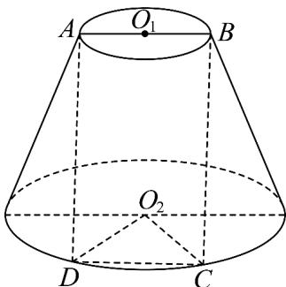
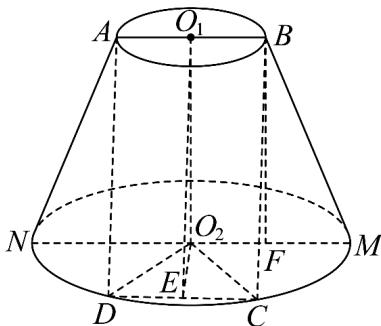

> [!faq]- 《专题02_棱柱_棱锥_棱台表面积与体积的六大常考题型_高效培优专项训练》官方解析
>
> > [!success]- **【答案】**  A. $6\sqrt{2}\pi$ B. $5\sqrt{10}\pi$ C. $4\sqrt{3}\pi$ D. $3\sqrt{10}\pi$
>
> > [!note]- **【分析】**
> > 根据题意，求得 $AD = 2\sqrt{3}$ ，取 CD 的中点 E，求得 $O_{1}E = 2\sqrt{3}$ ，设圆台的下底面圆的半径为 R，得到 R = CD = AB = 2，且 $O_{2}E = \sqrt{3}$ ，在直角 $\triangle O_{1}O_{2}E$ 中，求得 $O_{1}O_{2} = 3$ ，取 $O_{2}M$ 的中点 F，在直角 $\triangle BMF$ 中，求得母线 $BM = \sqrt{10}$ ，结合侧面积公式，即可求解。
>
> > [!note]- **【解析】**
> > 因为矩形 ABCD 的面积等于 $4\sqrt{3}$ ，且 AB = 2，
> >
> > 可得 $AB \times AD = 2AD = 4\sqrt{3}$ ，解得 $AD = 2\sqrt{3}$ ，
> >
> > 取 CD 的中点 E，连接 $O_{1}E$ ，则 $O_{1}E = 2\sqrt{3}$ ，
> >
> > 设圆台的下底面圆的半径为 R，因为 $\angle CO_{2}D = 60^{\circ}$ ， $\triangle CO_{2}D$ 为等边三角形，
> >
> > 因为 R = CD = AB = 2，且 E 为 CD 的中点，所以 $O_{2}E = \sqrt{3}$ ，
> >
> > 在直角 $\triangle O_{1}O_{2}E$ 中，可得 $O_{1}O_{2} = \sqrt{O_{1}E^{2} - O_{2}E^{2}} = 3$ ，
> >
> > 取 $O_{2}M$ 的中点 F，可得 $BF // O_{1}O_{2}$ 且 $BF = O_{1}O_{2} = 3$ ，
> >
> > 在直角 $\triangle BMF$ 中，BF = 3, MF = 1，可得 $BM = \sqrt{BF^{2} + MF^{2}} = \sqrt{10}$ ，
> >
> > 所以该圆台的侧面积为 $S = \pi(R + 1) \times BM = 3\sqrt{10}\pi$ 。
> >
> > 故选：D.
> >
> > 
