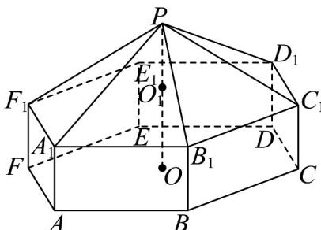

<!-- question-source:start -->
15．如图是一个搭建好的帐篷，它的下部是一个正六棱柱，上部是一个正六棱锥，其中帐篷的高为 $PO$ ，正六棱锥的高为 $PO_{1}$ ，且 $PO = 3PO_{1}$ 。设 $PO_{1} = 2\mathrm{m}$ ， $PA_{1} = 4\mathrm{m}$ ，求帐篷的表面积。

<!-- question-source:end -->

![[高中/课堂同步/题库/人教A版高中数学同步讲义(2026)/02_必修第二册/第八章 立体几何初步/专项训练/专题02_棱柱_棱锥_棱台表面积与体积的六大常考题型_高效培优专项训练/题型二_sec_03/questions/answers/Q00065001A1.md]]
