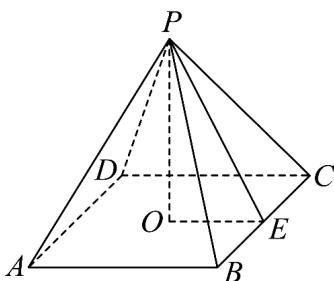

> [!faq]- 《专题02_棱柱_棱锥_棱台表面积与体积的六大常考题型_高效培优专项训练》官方解析
>
> > [!success]- **【答案】** D
>
> > [!note]- **【分析】**
> > 根据侧面积之和为底面积的2倍得到斜高和底面边长的关系，由勾股定理得到方程，求出斜高，进而求出底面积和侧面积，相加得到表面积.
>
> > [!note]- **【解析】**
> > 如图，PO 是正四棱锥的高，所以 $PO = \sqrt{6}$ ，PE 是斜高，
> >
> > 
> >
> > 由各侧面的面积之和是底面积的2倍可得 $4\times\frac{1}{2}BC\cdot PE=2BC^{2}$ ，所以BC=PE，
> > 在 $Rt\triangle POE$ 中， $PO=\sqrt{6}$ ， $OE=\frac{1}{2}BC=\frac{1}{2}PE$ ，所以 $6+\left(\frac{PE}{2}\right)^{2}=PE^{2}$ ，
> > 所以 $PE=2\sqrt{2}$ 底面积 $S_{1}=BC^{2}=PE^{2}=8$ ，侧面积为 $S_{2}=2S_{1}=16$ 表面积 $S=S_{1}+S_{2}=8+16=24$
> >
> > 故选 **D**.
