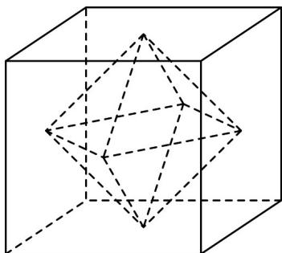

> [!faq]- 《专题02_棱柱_棱锥_棱台表面积与体积的六大常考题型_高效培优专项训练》官方解析
>
> > [!success]- **【答案】** 
>
> > [!note]- **【分析】**
> > 由题意知所得几何体是八面体，且八面体是由两个底面边长为 $2\sqrt{2}$ ，高为 2 的四棱锥组成，从而可求出其表面积.
>
> > [!note]- **【解析】**
> > 由题意知所得几何体是八面体，且八面体是由两个底面边长为 $2\sqrt{2}$ ，高为 2 的四棱锥组成，则该八面体的表面积是这两个四棱锥的侧面积之和。
> >
> > 又四棱锥的侧棱长为 $l = \sqrt{2^2 + 2^2} = 2\sqrt{2}$
> >
> > 所以以该正方体各个面的中心为顶点的多面体的表面积为
> >
> > $$
> > S = 8 \times \frac {1}{2} \times 2 \sqrt {2} \times 2 \sqrt {2} \times \sin 6 0 ^ {\circ} = 1 6 \sqrt {3}
> > $$
> >
> > 故答案为： $16 \sqrt{3}$
