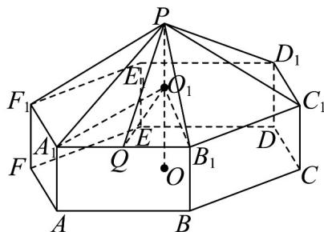
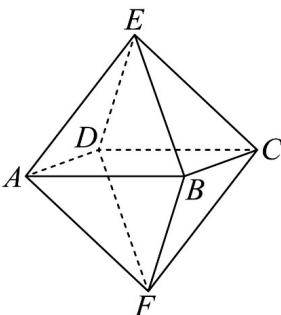

> [!faq]- 《专题02_棱柱_棱锥_棱台表面积与体积的六大常考题型_高效培优专项训练》官方解析
>
> > [!success]- **【答案】** $6\sqrt{39}+48\sqrt{3}\left(m^{2}\right)$
>
> > [!note]- **【分析】**
> > 将上面六棱锥的侧面积求出来，底面六棱柱的侧面积求出来，求和即可.
>
> > [!note]- **【解析】**
> > 解：连接 $O_{1}A_{1}$ 。因为 $PO_{1}=2m$ ， $PA_{1}=4m$
> >
> > 所以 $A_{1}B_{1} = A_{1}O_{1} = \sqrt{4^{2} - 2^{2}} = 2\sqrt{3}$ （m）
> >
> > 取 $A_{1}B_{1}$ 的中点为 Q，连接 $O_{1}Q$ 、PQ，
> >
> > 
> >
> > 易得 $PQ \perp A_{1}B_{1}$ ， $A_{1}Q = \frac{1}{2}A_{1}B_{1} = \sqrt{3}$
> >
> > $$
> > P Q = \sqrt {P A _ {1} ^ {2} - A _ {1} Q ^ {2}} = \sqrt {1 3} (\mathrm{m})
> > $$
> >
> > 设帐篷上部的侧面积为 $S_{1}$ ，下部的侧面积为 $S_{2}$
> >
> > 所以 $S_{1} = 6 \times \frac{1}{2} A_{1}B_{1} \cdot PQ = 6\sqrt{39}\left(\mathrm{m}^{2}\right)$
> >
> > $S_{2} = 6A_{1}B_{1}\cdot OO_{1} = 48\sqrt{3}\left(\mathrm{m}^{2}\right)$ ，所以搭建帐篷的表面积为 $S_{1} + S_{2} = 6\sqrt{39} +48\sqrt{3}\left(\mathrm{m}^{2}\right)$
> >
> > 16. 六氟化硫，化学式为 $\mathrm{SF}_6$ ，在常压下是十种无色、无臭、无毒、不燃的稳定气体，有良好的绝缘性，在电器工业方面具有广泛用途·六氟化硫分子结构为正八面体结构（正八面体是每个面都是正三角形的八面体）如图所示，硫原子位于正八面体的中心，6个氟原子分别位于正八面体的6个顶点·若相邻两个氟原子间的距离为 $2a$ ，则六氟化硫分子中6个氟原子构成的正八面体的表面积是（ ）（不计氟原子的大小）（ ）
> >
> > 【答案】
> >
> > 
> >
> > A. $8\sqrt{3} a^{2}$ B. $6\sqrt{3} a^{2}$ C. $12\sqrt{3} a^{2}$ D. $2\sqrt{3} a^{2}$
> >
> > 【答案】A
> > 【分析】利用三角形的面积公式求解即可.
> > 【详解】相邻两个氟原子间的距离为 $2a$ ，故正八面体的每个面都是边长为 $2a$ 的等边三角形，故正八面体的表面积为： $8 \times \frac{1}{2} \times 2a \times 2a \times \sin 60^{\circ} = 8\sqrt{3} a^{2}$
> >
> > 故选 **A**.
