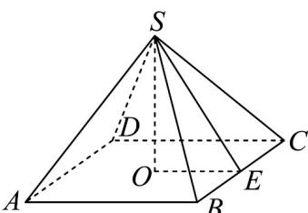

> [!faq]- 《专题02_棱柱_棱锥_棱台表面积与体积的六大常考题型_高效培优专项训练》官方解析
>
> > [!success]- **【答案】** A. $\frac{32\sqrt{6}}{3}$ B. $36\sqrt{6}$ C. $32\sqrt{3}$ D. $\frac{32\sqrt{3}}{3}$
>
> > [!note]- **【分析】**
> > 根据已知得出斜高，从而可得正四棱锥的高，由体积公式可得正四棱锥的体积.
>
> > [!note]- **【解析】**
> > 如图所示，正四棱锥 S-ABCD，BC=4，O 为底面正方形的中心，E 为 BC 的中点。
> > 由已知可得 $4 \times \frac{1}{2} \times 4 \times SE = 2 \times 4 \times 4$ ，所以 SE = 4，又 OE = 2，
> > 所以 $OS = \sqrt{SE^{2} - OE^{2}} = \sqrt{4^{2} - 2^{2}} = 2\sqrt{3}$ 所以正四棱锥的体积 $V = \frac{1}{3} \times 4 \times 4 \times 2\sqrt{3} = \frac{32\sqrt{3}}{3}$ .
> >
> > 故选：D.
> >
> > 
