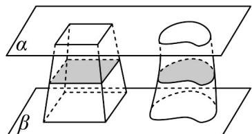

> [!faq]- 《专题02_棱柱_棱锥_棱台表面积与体积的六大常考题型_高效培优专项训练》官方解析
>
> > [!success]- **【答案】** A. $\frac{196\pi}{3}$ B. $28\sqrt{5}\pi$ C. $\frac{28\sqrt{5}\pi}{3}$ D. $28\sqrt{3}\pi$
>
> > [!note]- **【分析】**
> > 先计算圆台的高，再利用圆台的体积公式计算即可.
>
> > [!note]- **【解析】**
> > 因为圆台上底面半径为 2，下底面半径为 4，母线长为 7，
> >
> > 所以圆台的高为 $\sqrt{7^2 - (4 - 2)^2} = 3\sqrt{5}$
> >
> > 所以该圆台的体积为 $\frac{1}{3}\pi\left(2^{2}+4^{2}+2\times4\right)\times3\sqrt{5}=28\sqrt{5}\pi$
> >
> > 故选：B
> >
> > 42．中国南北朝时期数学家、天文学家祖冲之、祖暅父子提出介于两个平行平面之间的两个几何体，被任一平行于这两个平面的平面所截，如果两个截面的面积相等，则这两个几何体的体积相等·一个上底面边长为1，下底面边长为2，高为3的正四棱台与一个不规则几何体如图所示，则该不规则几何体的体积为—
> >
> > 
> >
> > 【答案】7
> >
> > 【分析】利用台体的体积公式求正四棱台的体积，再根据祖暅原理即可得结果.
> >
> > 【详解】由题意可知：正四棱台的体积为 $V = \frac{1}{3} \times \left(1^{2} + 2^{2} + \sqrt{1^{2} \times 2^{2}}\right) \times 3 = 7$
> >
> > 根据祖暅原理可知该不规则几何体的体积为 7.
> >
> > 故答案为：7.
