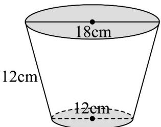

> [!faq]- 《专题02_棱柱_棱锥_棱台表面积与体积的六大常考题型_高效培优专项训练》官方解析
>
> > [!success]- **【答案】**  A. $117\sqrt{15}\pi cm^{3}$ B. $351\sqrt{15}\pi cm^{3}$ C. $171\sqrt{15}\pi cm^{3}$ D. $513\sqrt{15}\pi cm^{3}$
>
> > [!note]- **【分析】**
> > 确定圆台的上、下两个底面的半径，求得圆台的高，代入圆台的体积公式计算即可．
>
> > [!note]- **【解析】**
> > 由题意，圆台的上底面圆的半径是9cm，下底面圆的半径是6cm，母线长是12cm，
> > 可得该圆台的高为 $\sqrt{12^{2}-(9-6)^{2}}=3\sqrt{15}\mathrm{cm}$ 则该圆台的体积为 $\frac{1}{3}\pi(9^{2}+6^{2}+9\times6)\times3\sqrt{15}=171\sqrt{15}\pi cm^{3}$
> >
> > 故选 **C**.
