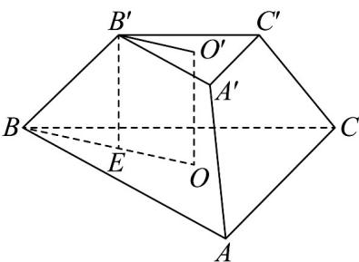

> [!faq]- 《专题02_棱柱_棱锥_棱台表面积与体积的六大常考题型_高效培优专项训练》官方解析
>
> > [!success]- **【答案】** C
>
> > [!note]- **【分析】**
> > 直接运用三角形面积公式，结合正三棱台的几何性质、棱台体积公式进行求解即可.
>
> > [!note]- **【解析】**
> > 如图所示， $O'$ ，O分别是上，下底面的中心，连接 $OO'$ ， $O'B'$ ，OB
> >
> > 
> >
> > 在平面 $BOO'B'$ 内作 $B'E \perp BO$ 于 $E$
> >
> > 因为正三棱台的上底边长为 $\sqrt{3}$ ，下底边长为 $4\sqrt{3}$
> >
> > 所以上底面面积为 $\frac{1}{2} \times \sqrt{3} \times \sqrt{3} \times \frac{\sqrt{3}}{2} = \frac{3\sqrt{3}}{4}$
> >
> > 上底面三角形外接圆半径为 $B^{\prime}O^{\prime}=\frac{1}{2}\times\frac{\sqrt{3}}{\frac{\sqrt{3}}{2}}=1$
> >
> > 下底面面积为 $\frac{1}{2} \times 4\sqrt{3} \times 4\sqrt{3} \times \frac{\sqrt{3}}{2} = 12\sqrt{3}$
> >
> > 下底面三角形外接圆半径为 $BO=\frac{1}{2}\times\frac{4\sqrt{3}}{\frac{\sqrt{3}}{2}}=4$
> >
> > 于是该正三棱台的高为 $\sqrt{B^{\prime}B^{2}-BE^{2}}=\sqrt{5^{2}-(4-1)^{2}}=4$
> >
> > 因此该正三棱台的体积为 $\frac{1}{3} \times \left( \frac{3\sqrt{3}}{4} + \sqrt{\frac{3\sqrt{3}}{4} \times 12\sqrt{3}} + 12\sqrt{3} \right) \times 4 = 21\sqrt{3}$
> >
> > 故选 **C**
